# iot_socket_2025
###  vmware, putty 시작하기
- vm workstation - restart guest
- putty configuration - ubuntu load(ip - 192.168.74.128)
- id - reed
- pass - 1234
- 

## 99일차(6/30)
### vmware, ubuntu, PuTTy 설치
- ubuntu 디스크이미지 파일 다운로드
    1. https://ubuntu.com/ 
    2. Download Ubuntu - Download Ubuntu Desktop -Ubuntu 24.04.2 LTS download
        - 

- PuTTy 다운로드
    1. https://www.putty.org/ 
    2. Download PuTTY - 64-bit x86 : putty-64bit-0.83-installer.msi

- vmware 가상머신 설치
    1. https://support.broadcom.com/ - 회원가입 및 로그인
    2. VMware Cloud Foundation-  My Downloads 이동 
        - 
    3. Free Software Downloads available HERE 클릭
    4. VMware Workstation Pro - VMware Workstation Pro 17.0 for Windows - 17.6.3
    5. 이용약관 동의 - 다운로드 버튼 클릭 - 주소정보 입력
    6. VMware-workstation-full-17.6.3-24583834 응용프로그램파일을 관리자권한으로 실행 - 다운로드
    7. VMware Workstation 아이콘 실행 - create a new virtual machine - **installer disc image file을 다운로드한 ubuntu로 하기**
    8. next, finish 계속 해서 설치 마무리
        - 
    9. 우분투 기본 설정하기 
        - 언어, 계정(reed, 1234), 최소 설정 등  [참고사이트](https://movefun-tech.tistory.com/23)
        - 설치 후 다시 시작
        - 로그인- 왼쪽하단버튼- cmd 검색해서 실행
        - ifconfig 설치 [참고사이트](https://yigongyikong.tistory.com/866)
            ```
            ~$ sudo apt install net-tools
            ~$ ifconfig
            
            ```
            - 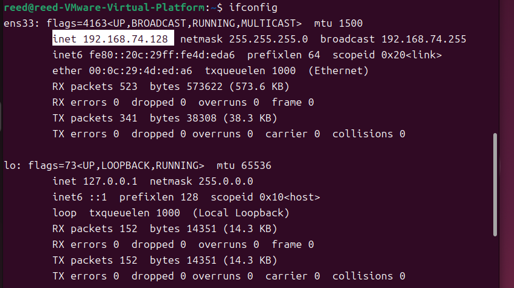
        - openssh-server 설치
            ```
            ~$ sudo apt install openssh-server
            ~$ netstat -lnpt | grep :22
            ```
    10. Putty configuration
        - 다운로드한 putty 실행파일 실행 , configuration 설정
            - 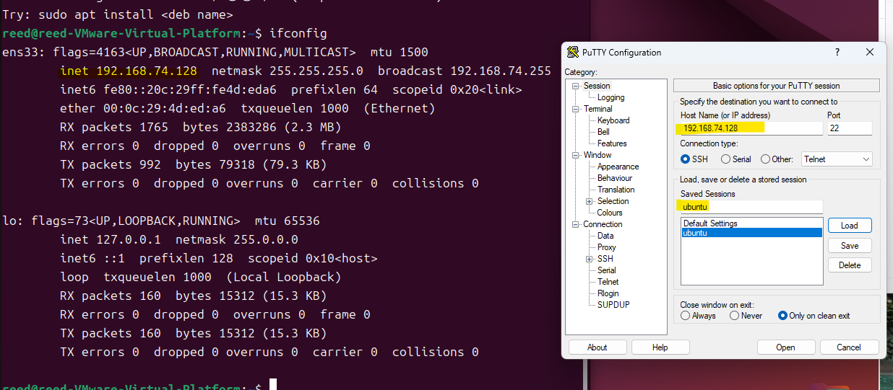
            - 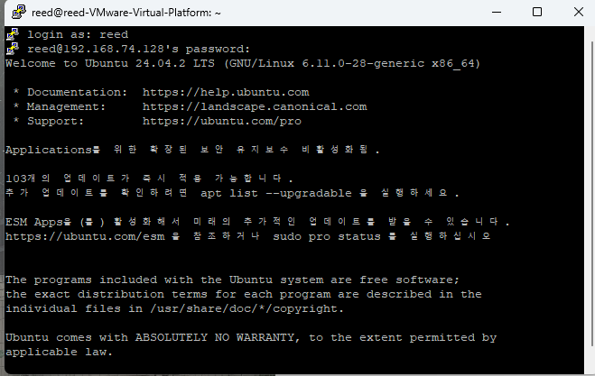
        

### TCP/IP 프로토콜 개요

|호출순서|함수|
|:--:|:--:|
|소켓생성|socket()|
|소켓주소할당|bind()|
|연결요청대기|listen()|
|연결허용|accept()|
|데이터송/수신|read/write()|
|종료|close()|


#### 문법 with Putty   [./소켓/chapter1]
1. gcc 컴파일러 
    - gcc 컴파일러 설치
        ```
        sudo apt install gcc
        ```
    - C 파일 작성
        ```
        touch main.c
        nano main.c
        cat main.c
        ```
    - 실행명령
        ```
        gcc main.c -o main.out
        ./main.out
        ```
    - 

2. 자주 사용하는 기본 명령어
    - 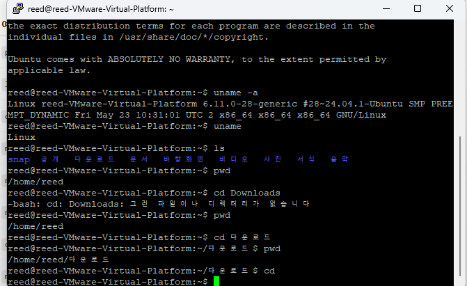
    - 
    - 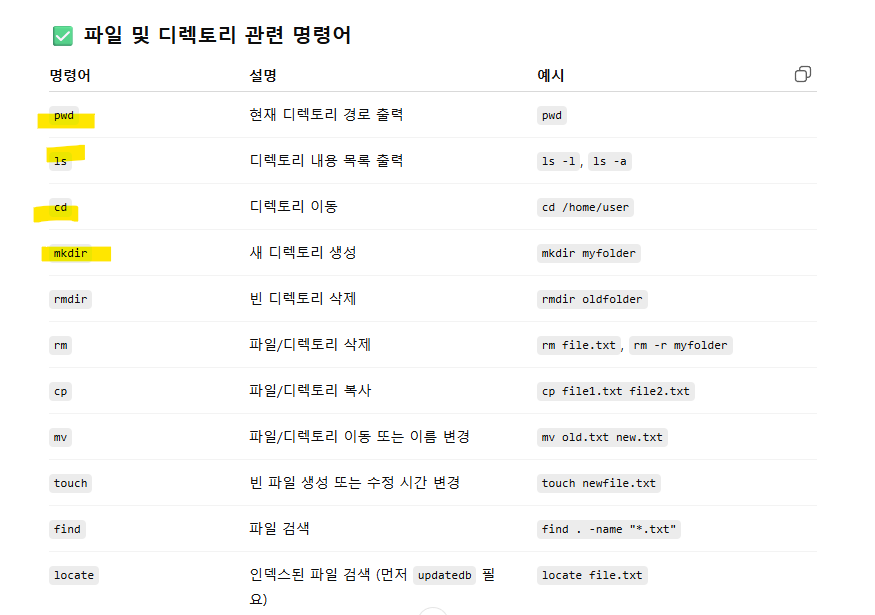
    - 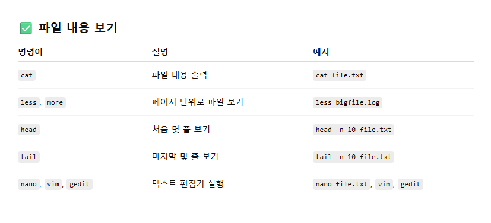
    - 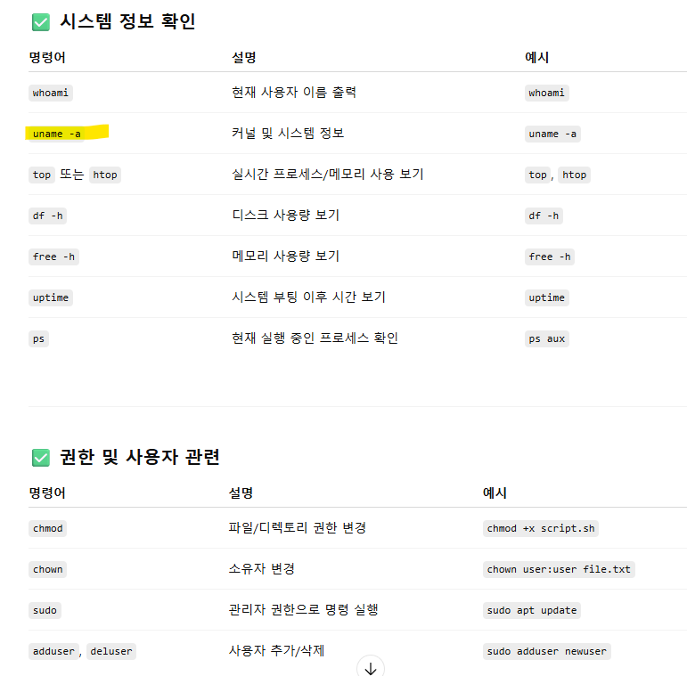
    - 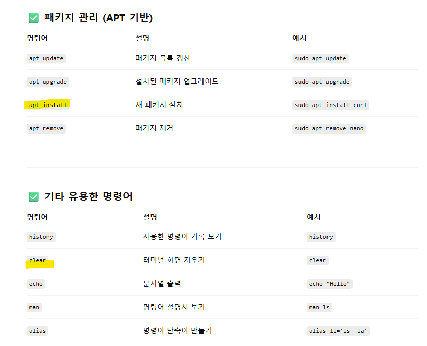

    - 파일/디렉토리 명령어 연습
        - 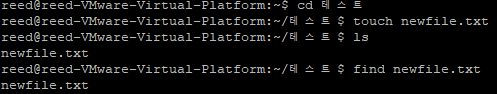
        - 
        - 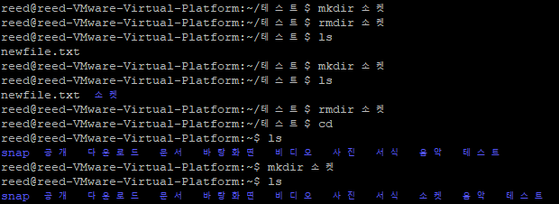
        - 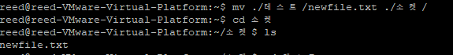
        - 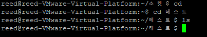

3. 리눅스에서 파일을 열거나 생성
    - 기본형태
        ```C
        int open(const char *pathname, int flags[, mode_t mode]);
        ```
        - pathname: 열고자 하는 파일 경로
        - flags: 파일을 어떻게 열지 설정하는 옵션 (읽기, 쓰기, 생성 등)
        - mode: 새 파일을 만들 때 퍼미션 설정 (예: 0644), O_CREAT가 있을 때만 사용됨

    - 플래그
        |플래그|의미|
        |:--:|:--:|
        |O_RDONLY|읽기 전용으로 연다|
        |O_WRONLY|쓰기 전용으로 연다|
        |O_RDWR|읽기 + 쓰기 모두 가능하게 연다|
        |O_CREAT|파일이 없으면 새로 만든다|
        |O_APPEND|파일 끝에 내용을 추가해서 쓴다|
        |O_TRUNC|파일 열 때 기존 내용을 지우고 빈 상태로 연다|
        - 플래그들은 #define된 상수입니다. 예를 들어, O_RDONLY는 내부적으로 그냥 0이에요.
        - 플래그는 비트 연산(|)으로 조합할 수 있어요.

    - 파일 디스크립터
        |이름|의미|번호|
        |:--:|:--:|:--:|    
        |stdin|표준 입력 (키보드 등)|0|
        |stdout|표준 출력 (화면 등)|1|
        |stderr|표준 에러 출력|2|
        - fileno() 함수는 FILE* 스트림 (예: stdin, stdout, stderr)이 내부적으로 사용하는 파일 디스크립터 번호(int)를 반환합니다.
        ```c
        #include <unistd.h>
        int main() {
        printf("stdin FD: %d\n", fileno(stdin));   // 0
        return 0;
        }

        ```
        - open()은 성공하면 파일 디스크립터(file descriptor)를 반환합니다. 이건 파일을 나타내는 양수(보통 3 이상) 숫자입니다.
        - 0 이상 :	성공 
        - -1	: 실패 
            ```c
            #include <stdio.h>
            #include <fcntl.h>
            #include <stdlib.h>
            #include <unistd.h>


            int main()
            {
                    int fd;
                    fd = open("a.txt", O_CREAT|O_RDONLY, 0644);
                    if (fd <0)
                    {
                            perror("could not open a.txt");
                            exit(1);
                    }
                    else
                    {
                            printf("open success!\n");
                            printf("file descripter(0이상이어야지 성공) : %d\n" , fd);
                    }
                    close(fd);
                    return 0;

            }
            ```
    - 권한 확인
        ```cs
            ls -l
        ```
        - 
        - ---sr-s--- 에서 소유자와 기타 사용자 모두 읽기, 쓰기, 실행 권한이 없음 →즉, 파일 소유자도 읽거나 쓸 수 없는 상태입니다.
        - 이 때문에 프로그램에서 permission denied 오류가 나는 겁니다.
4. 파일 권한(퍼미션) 형식

    |위치|의미|
    |:--:|:--:|
    |1번째 문자|파일 종류|
    |2~4번째 문자|소유자(user) 권한|
    |5~7번째 문자|그룹(group) 권한|
    |8~10번째 문자|기타 사용자(other) 권한|
    - 
    -    
    - 권한 확인
        ```c
        //  -: 일반 파일
        // rwx: 소유자는 읽기, 쓰기, 실행 가능
        // r-x: 그룹은 읽기, 실행 가능 (쓰기 불가)
        // r--: 기타 사용자는 읽기만 가능
        -rwxr-xr--
        ```
    - 권한 변경
        - 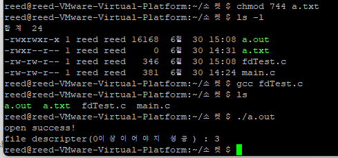
        - 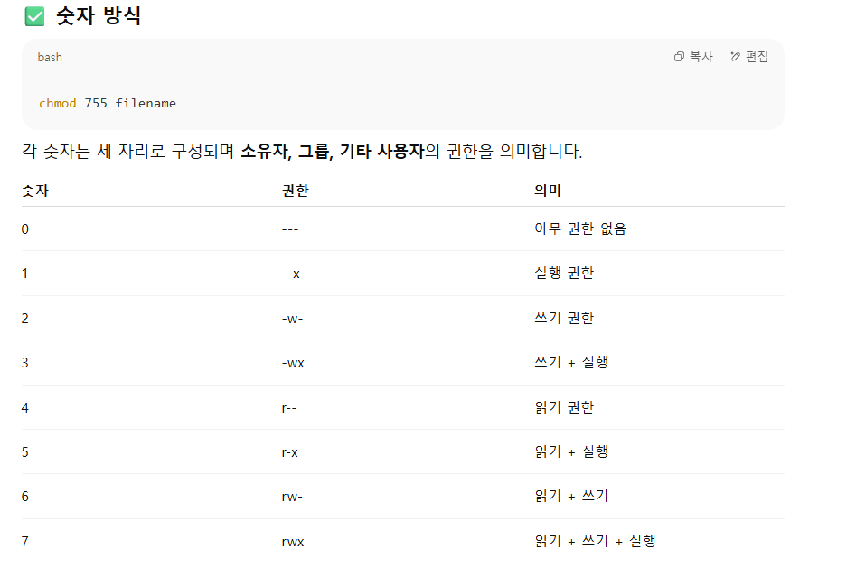
5. 성공, 실패 메시지 출력

    |상황|함수|출력대상|
    |:--:|:--:|:--:|    
    |성공 메시지|printf(), puts() 등|stdout (표준 출력, 화면)|
    |에러 메시지|perror(), fprintf(stderr, ...)|stderr (표준 에러 출력)|

6. 리틀 엔디안 vs 빅 엔디안 (Little Endian vs Big Endian)

    |개념|빅엔디안 (Big Endian)|리틀엔디안 (Little Endian)|
    |:--:|:--:|:--:|
    |의미|큰 바이트가 앞|작은 바이트가 앞|
    |저장 순서 (메모리 or 전송)|상위 바이트 → 하위 바이트|하위 바이트 → 상위 바이트|
    |예: 0x12345678|12 34 56 78|78 56 34 12|
    |사용처|네트워크 전송, 일부 CPU|x86/x86-64 (인텔/AMD) 등|

    - 네트워크에서는 시스템마다 엔디안 방식이 다르기 때문에, 모든 데이터는 "빅엔디안"으로 전송하자는 규칙이 생겼습니다.
    - 이를 "네트워크 바이트 오더(Network Byte Order)" = Big Endian 이라고 부릅니다.
    - 변환
        |함수|의미|목적|
        |:--:|:--:|:--:|
        |htonl(x)|Host TO Network Long|리틀엔디안 → 빅엔디안 변환|
        |ntohl(x)|Network TO Host Long|빅엔디안 → 리틀엔디안 변환|
        - 대부분 PC/서버는 리틀엔디안 (작은 바이트가 먼저)
        - 하지만 네트워크에서는 빅엔디안이 표준
        - 그래서 데이터를 보내거나 받을 때는 변환이 필요함

    1. 리틀 엔디안
    ```c
    #include <stdio.h>

    void main()
    {
        int n =  0x1234567;         // 16진수: 0x01234567
        char *pn = &n;              // int형 변수 n의 주소를 char 포인터로 저장

        printf("1st : %p , %#x\n" , &(*pn),  *pn);
        printf("2nd : %p , %#x\n" , &(*pn),  *(pn+1));
        return 0;
    }
    ```
    - 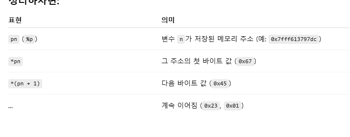
    - 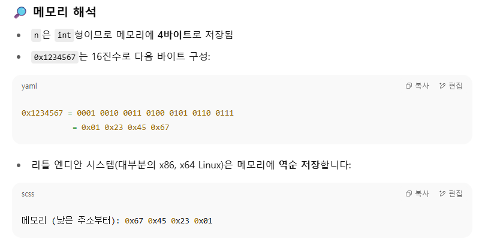
 
    2. 리틀 엔디안 -> 빅 엔디안 변환
        ```c
        #include <stdio.h>
        #include <arpa/inet.h>  // htonl, ntohl 함수가 선언된 헤더

       
        void  main()
        {

                unsigned short port = 0x1234;
                unsigned int ip = 0x12345678;

                unsigned short network_port;
                unsigned int network_ip;

                network_port = htons(port);
                network_ip = htonl(ip);

                printf("ip:%#x", ip);
                printf(" port : %#x\n", port);
                printf("conversion ip: %#x", network_ip);
                printf("conversion port : %#x\n", network_port);

        }


        ```
        - 
        

7. 프로토콜 체계, 소켓 타입(전송방식)
    |인터넷프로토콜 체계|
    |:--:|
    |PF_INET<br/>IPv4 인터넷프로토콜 체계|
    |PF_INET6<br/>IPv6 인터넷프로토콜 체계|

    |소켓 타입|표현|
    |:--:|:--:|
    |TCP(연결지향형 소켓)|SOCK_STREAM|
    |UDP(비연결지향형 소켓)|SOCK_DGRAM|

    ```C
    #include <sys/socket.h>
    #include <netinet/in.h>

    //PF_INET은 IPv4 프로토콜을 사용하겠다는 뜻이고,
    //SOCK_STREAM은 TCP 소켓 타입을 의미합니다.
    int sockfd = socket(PF_INET, SOCK_STREAM, 0);

    ```
## 100일차(7/1)
### 소켓  [./소켓/chapter2]
#### 바이트 정렬 함수 with Putty 
- 문자열 정보 처리
    ```c
    #include <arpa/inet.h>
    ```
    - printf("%#x", ...) 등으로 출력하면: 호스트 바이트 순서, 즉 보통의 PC(리틀 엔디안 시스템) 기준으로 정수 해석 결과가 출력됩니다. 
    1. inet_addr() -  문자열로 된 IPv4 주소를 네트워크 바이트 오더(빅엔디안)로 변환
        - 매개변수 -  cp: 점으로 구분된 문자열 형식의 IPv4 주소 ("192.168.0.1" 등)
        - 반환값 - 변환된 32비트의 IPv4 주소 (네트워크 바이트 순서)
        - 오류가 발생하거나 잘못된 주소일 경우 INADDR_NONE (-1) 반환
        ```C
        #include <arpa/inet.h>
        void main()
        {

                char* addr = "192.168.0.1";
                unsigned int cv_addr = inet_addr(addr);
                if (cv_addr == INADDR_NONE) perror("Error");
                else printf("addrss : %#x\n",cv_addr );   //addrss : 0x100a8c0
                //printf("%#x", ...) 등으로 출력하면: 호스트 바이트 순서, 즉 보통의 PC(리틀 엔디안 시스템) 기준으로 정수 해석 결과가 출력됩니다.
               

        }
        ```
        - 
    2. inet_aton() - 문자열 IP → struct in_addr
        - 매개변수1 - cp: 점으로 구분된 문자열 형태의 IPv4 주소 (예: "192.168.1.1")
        - 매개변수2 - inp: 변환된 IP 주소를 저장할 struct in_addr 타입 포인터
        - 반환값 - 변환 성공 시 1 , 변환 실패 시 0
        ```C

        void main()
        {

                const char* addr ="192.168.0.1";
                struct sockaddr_in addr_inet;

                if (!inet_aton(addr, &addr_inet.sin_addr))
                {
                        perror("conversion failed");
                }
                else
                {
                        printf("conversion addr : %#x\n",addr_inet.sin_addr.s_addr); // 0x100a8c0

                }
        }

        ```
        - 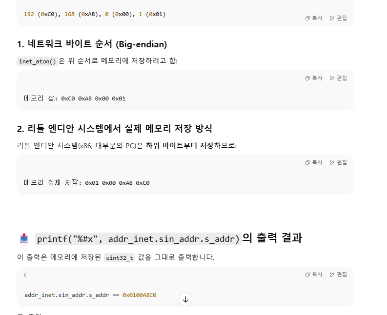
    - 결론

    |의미|값 (16진수)|설명|
    |:--:|:--:|:--:|
    |호스트 바이트 순서|0x100a8c0|inet_addr() 결과를 리틀엔디안으로 printf 해석|
    |네트워크 바이트 순서|0xC0A80001|실제 IP: 192.168.0.1 (정상적 변환 결과)|

#### 소켓 개념, 특징, 구조 with Putty 
- 구조체에서 사용되는 타입 정의(type definition)

|타입 이름|실제 타입|의미|주로 쓰이는 곳|
|:--:|:--:|:--:|:--:|
|sa_family_t|unsigned short|주소 체계 (IPv4 주소 체계를 의미하는 AF_INET은 정수 값 2입니다)|sockaddr, sockaddr_in, etc.|
|in_addr_t|uint32_t|IPv4 주소 (32비트)|inet_addr(), in_addr.s_addr|
|in_port_t|uint16_t|포트 번호 (16비트)|sockaddr_in.sin_port, htons() 등|
   
- IPv4 관련 구조체-  소켓 프로그래밍, IP 주소 처리, 네트워크 통신에서 매우 자주 사용
    ```c
    #include <netinet/in.h>
    ```
    1. struct in_addr
        - IPv4 주소를 저장하는 구조체
        - 보통 inet_aton(), inet_pton() 등에서 변환된 IP 주소를 저장할 때 사용 
        ```C
        struct in_addr {
            in_addr_t s_addr;  // 32비트 IPv4 주소 (네트워크 바이트 순서)
        };
        ```

    2. struct sockaddr_in
        - IPv4 주소용 소켓 주소 구조체
        - struct sockaddr를 기반으로 IP와 포트 정보를 담음
        ```C
        struct sockaddr_in {
            sa_family_t    sin_family; // AF_INET
            in_port_t      sin_port;   // 포트 번호 (네트워크 바이트 순서)
            struct in_addr sin_addr;   // IPv4 주소
            unsigned char sin_zero[8]; // 구조체 크기 맞춤용 패딩
        };
        ```
        - 
        - 
    3. struct sockaddr 
    ```c
    struct sockaddr {
        sa_family_t sa_family;
        char        sa_data[14];
    }; 
    ```
    4. memset -  구조체를 0으로 초기화할 때 자주 사용됩니다.
        ```c
        #include <string.h>
        void *memset(void *ptr, int value, size_t num);
        ```
        - 매개변수 설명

        |매개변수|설명|
        |:--:|:--:|
        |ptr|값을 채울 메모리의 시작 주소|
        |value|채울 값 (하위 1바이트만 사용됨)|
        |num|채울 바이트 수|

        ```c
        #include <stdio.h>
        #include <arpa/inet.h>
        #include <string.h>
        #include <stdint.h>

        //구조체 in_addr 타입처럼 사용자가 만든 구조체
        struct myin_addr {

                uint32_t s_addr;
        };

        //구조체 sockaddr_in 타입처럼 사용자가 만든 구조체
        struct mysockaddr_in
        {
                unsigned short sin_family;
                struct myin_addr sin_addr;
                uint16_t sin_port;
        };

        int main(void){

                struct mysockaddr_in myaddr;
                memset(&myaddr, 0, sizeof(myaddr));

                printf("sin_family: %d\n", myaddr.sin_family);   //0
                printf("sin_addr: %d\n", myaddr.sin_addr.s_addr);  //0
                printf("sin_port: %d\n", myaddr.sin_port);   //0
                return 0;
        }

        ```
### TCP 서버 클라이언트
#### TCP 서버-클라이언트 프로그램의 기본 구조 with Putty [./소켓/chapter2/base_server.c] [./소켓/chapter2/base_client.c]
- 서버에 있는 문자열을 클라이언트가 수신
- 서버
    ```c
    #include <stdio.h>
    #include <stdlib.h>
    #include <unistd.h>
    #include <string.h>
    #include <arpa/inet.h>


    int main(int argc, char** argv)
    {
            int server_fd, client_fd; //서버 소켓 파일 디스크립터 ,  클라이언트 소켓 파일 디스크립터 (accept 후 생성)
            struct sockaddr_in server_addr, client_addr;  //서버와 클라이언트 주소 정보를 담는 구조체
            socklen_t client_addr_len;   //클라이언트 주소 구조체 크기
            const char* message = "Hello World~\n";   // 클라이언트에 보낼 문자열

            if ((server_fd = socket(PF_INET, SOCK_STREAM, 0)) == -1)   //socket() 함수로 TCP 소켓 생성 (PF_INET=IPv4, SOCK_STREAM=TCP)
            {
                    perror("socket failed");
                    exit(1);
            }
            memset(&server_addr, 0, sizeof(server_addr));  
            server_addr.sin_family = AF_INET;   //AF_INET은 IPv4)
            server_addr.sin_addr.s_addr = INADDR_ANY;   //모든 네트워크 인터페이스에서 들어오는 연결 허용
            server_addr.sin_port = htons(atoi(argv[1]));  // 서버실행 ./base_server 9090


            if (bind(server_fd, (struct sockaddr*)&server_addr, sizeof(server_addr)) == -1 )  //소켓에 IP 주소와 포트 번호 할당(바인딩)
            {
                    perror("bind failed");
                    close(server_fd);
                    exit(1);
            }

            if(listen(server_fd, 5) == -1)  //클라이언트 연결 대기 상태로 변경 (listen 호출) , 큐 길이 5 (동시 접속 대기 최대 5명)
            {
                    perror("listen failed");
                    close(server_fd);
                    exit(1);
            }
            client_addr_len = sizeof(client_addr);   //동시에 5명의 클라이언트가 접속하더라도, 각각의 accept() 호출에서 client_addr_len은 항상 한 명에 대한 주소 크기만 사용됩니다.
            if( (client_fd = accept(server_fd, (struct sockaddr*)&client_addr, &client_addr_len)) == -1 )  //accept는 새로운 소켓(client_fd) 생성 (클라이언트와 통신용)
            {
                    perror("accept failed");
                    close(server_fd);
                    exit(1);
            }
            if (write(client_fd, message, strlen(message)) == -1 ) perror("write failed");

            close(client_fd);
            close(server_fd);
            return 0;
    }


    ```
- 클라이언트
    ```c
    #include <stdio.h>
    #include <stdlib.h>
    #include <arpa/inet.h>
    #include <string.h>
    #include <unistd.h>

    int main(int argc, char** argv)
    {

            int sock_fd;    //클라이언트 소켓 디스크립터
            struct sockaddr_in  server_addr;   //서버의 주소 정보를 저장할 구조체
            char buf[1024];   //서버에서 받는 데이터를 저장할 버퍼
            int recv_len;   //실제로 받은 바이트 수를 저장할 변수


            if((sock_fd = socket(PF_INET, SOCK_STREAM, 0) ) == -1 )
            {
                    perror("socket failed");
                    exit(EXIT_FAILURE);
            }

            memset(&server_addr , 0, sizeof(server_addr));
            server_addr.sin_family = AF_INET;
            server_addr.sin_addr.s_addr = inet_addr(argv[1]);  // 클라이언트 실행 ./base_server 127.0.0.1 9090     //ip주소
            server_addr.sin_port = htons(atoi(argv[2]));    // 포트 번호

            if (connect(sock_fd, (struct sockaddr*)&server_addr, sizeof(server_addr)) == -1 )  //서버에 연결 시도
            {
                    close(sock_fd);
                    exit(EXIT_FAILURE);
            }

            recv_len=recv(sock_fd, buf, sizeof(buf)-1, 0);  //서버에서 메시지 수신 , 최대 1023 바이트까지 받고, recv_len에 받은 길이 저장

            if (recv_len == -1 )
            {
                    printf("receive failed");
            }
            printf("Message from server : %s %ld %s \n",buf, sizeof(buf), buf[14]);
            close(sock_fd);
            return 0;


    }


    ```
- TCP 클라이언트 실행
    - 
    - 127.0.0.1:9090 요청은 보통 자기 자신 컴퓨터에서 실행 중인 서버(9090번 포트)에 접근
    - C언어에서 문자열(string)은 **널 문자('\0')**로 끝나는 문자 배열이에요. 문자열의 실제 문자 개수 + 널 문자('\0') 1개 를 저장할 공간이 필요해요.
    - 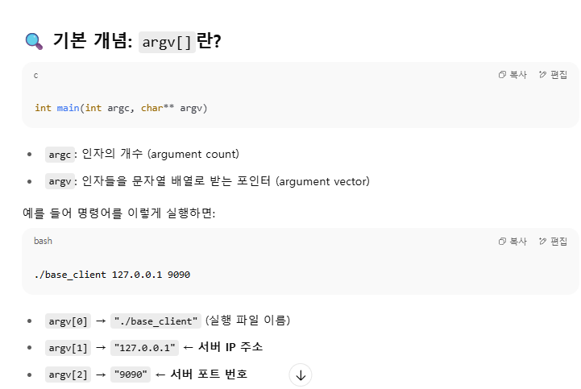

####  TCP 서버-클라이언트 분석

- TCP 서버

    |호출순서|함수|
    |:--:|:--:|
    |소켓생성|socket()|
    |소켓주소할당|bind()|
    |연결요청대기|listen()|
    |연결허용|accept()|
    |데이터전송|recv(), send()|
    |종료|close()|

    1. socket함수
        ```c
        #include <sys/types.h>
        #include <sys/socket.h>

        int socket(
            int domain, 
            int type, 
            int protocol
        );
        ```
        - domain - 주소 체계 지정 , IPv4기반의 AF_INET 
        - type - 소켓 타입 지정 , SOCK_STREAM, SOCK_DGRAM
        - protocol - 사용할 프로토콜 지정 , 대개는 0을 넣는다. 

    2. bind함수
        ```c
        #include <sys/types.h>
        #include <sys/socket.h>

        int bind(
            int sock,
            const struct sockaddr *addr,
            socklent_t addrlen
        );
        ```
        - sock - 클라이언트 접속을 수용하는 소켓, 지역 IP주소와 지역 포트 번호가 아직 결정되지 않은 상태
        - addr - 소켓 주소 구조체, 통신 프로토콜에 따른 주소 정보를 담고 있다. **TCP/IP의 경우 sockaddr_in 또는 sockaddr_in6 구조체를 사용하되, 지역IP주소와 지역포트번호로 초기화하여 전달한다.(struct sockaddr*로 형변환)**
        - addrlen - 소켓 주소 구조체의 길이(바이트 단위)
    3. listen함수
        ```c
        #include <sys/types.h>
        #include <sys/socket.h>
        int listen(
           int sock,
           int backlog
        );
        ```
        - sock - 클라이언트 접속을 수용하는 소켓, 이전에 bind()함수를 호출하여 지역IP 주소와 지역 포트번호를 설정한 상태
        - backlog - 서버가 당장 처리하지 않더라도 접속 가능한 클라이언트의 개수, 클라이언트의 접속정보는 연결 큐에 저장되는데 backlog는 이 연결 큐의 길이를 나타낸다.

    4. accept함수
       ```c
        #include <sys/types.h>
        #include <sys/socket.h>
        int accept(
           int sock,
           struct sockaddr *addr,
           socklen_t *addrlen
        );
        ```
        - sock - 클라이언트 접속을 수용하는 소켓,  이전에 bind()함수를 호출하여 지역IP 주소와 지역 포트번호를 설정하고, listen()함수로 TCP 상태를 LISTENING으로 변경한 상태
        - addr - 소켓 주소 구조체를 전달하면, 접속한 클라이언트의 주소정보로 채워진다.
        - addrlen - 운영체제에 따라 int 또는 socklen_t 타입의 변수를 준비하고 addr이 가리키는 소켓 주소 구조체의 크기로 초기화 하여 전달
    5. recv, sent함수 (데이터전송함수) 
    6. close함수
        ```c
        #include <unistd.h>
        int close(int fd);
        ```

- TCP 클라이언트

    |호출순서|함수|
    |:--:|:--:|
    |소켓생성|socket()|
    |서버에 접속|connect()|
    |데이터전송|recv(), send()|
    |종료|close()|
    
    1. socket함수

    2. connect함수
        ```c
        #include <sys/types.h>
        #include <sys/socket.h>
        int connect(
            int sock,
            const struct sockaddr *addr;
            socklen_t addrlen
        );
        ```
        - sock - 서버와 통신하는 소켓
        - addr - 소켓 주소 구조체를 서버주소로 초기화하여 전달한다.
        - addrlen - 소켓 주소 구조체의 길이(바이트 단위)
        - client_addr이 필요없는 이유-  운영체제가 자동으로 지역 IP주소와 지역 포트번호를 할당해준다. 
    3. send함수(송신)
        ```c
        #include <sys/types.h>
        #include <sys/socket.h>
        ssize_t send(
            int sock,
            const void *buf,
            size_t len,
            int flags
        );
        ```
        - sock - 서버와 연결된 소켓
        - buf - 보낼 데이터를 담고 있는 응용 프로그램의 버퍼의 주소
        - len - 보낼 데이터의 크기(바이트 단위)
        - flags - send()함수 동작을 바꾸는 옵션, 거의 항상 0을 사용

    4. recv함수(수신)
        ```c
        #include <sys/types.h>
        #include <sys/socket.h>
        ssize_t recv(
            int sock,
            void *buf,
            size_t len,
            int flags
        );
        ```
        - sock - 서버와 연결된 소켓
        - buf - 받은 데이터를 저장할 응용 프로그램의 버퍼의 주소
        - len - 운영체제의 수신 버퍼로부터 복사할 최대 데이터 크기, 이 값은 buf가 가리키는 응용 프로그램 버퍼보다 크지 않아야 한다.
        - flags -recv()함수 동작을 바꾸는 옵션
        ```c
            recv_len=recv(sock_fd, buf, sizeof(buf)-1, 0);  //서버에서 메시지 수신 , 최대 1023 바이트까지 받고, recv_len에 받은 길이 저장
        ```   
    5. close함수

#### 클라이언트-서버 구조에서 양방향 통신 - 에코서버, 에코 클라이언트
- 전체 동작 흐름 요약
    1. 서버 실행
        - 서버는 지정된 포트에서 bind(), listen()을 통해 연결 대기
        - 클라이언트의 연결 요청이 오면 accept()를 통해 연결 수락
    2. 클라이언트 실행
        - 서버의 IP와 포트로 connect() 시도
        - 연결이 성공하면 통신 시작
    3. 양방향 통신
        - 클라이언트: 사용자의 입력을 받아 서버로 send() , 서버의 응답을 recv()로 받아 출력
        - 서버: 클라이언트가 보낸 메시지를 recv()로 수신,  받은 데이터를 다시 클라이언트로 send() (에코)
        - `한 번의 메시지 주고받기마다 끝나고, 이전 메시지는 저장하거나 쌓아두지 않음.`
    4. 종료
        - 클라이언트에서 "Q" 또는 "q" 입력 시 루프 종료 → 서버 소켓과 클라이언트 소켓 종료

- 서버
    ```c
    #include <stdio.h>
    #include <stdlib.h>
    #include <unistd.h>
    #include <string.h>
    #include <arpa/inet.h>


    #define BUFFER_SIZE 1024

    int main(int argc, char* argv[])
    {
            int server_fd, client_fd;
            struct sockaddr_in server_addr, client_addr;
            socklen_t client_addr_len;
            char buffer[BUFFER_SIZE];
            ssize_t bytes_read;

            if (argc !=2)
            {
                    printf("%s <port>\n", argv[0]);
                    exit(1);
            }

            server_fd = socket(PF_INET , SOCK_STREAM,0);
            if (server_fd == -1 )
            {
                    perror("socket failed");
                    exit(1);
            }

            memset(&server_addr, 0, sizeof(server_addr));
            server_addr.sin_family = AF_INET;
            server_addr.sin_addr.s_addr = INADDR_ANY;
            server_addr.sin_port =  htons(atoi(argv[1]));

            if (bind(server_fd, (struct sockaddr*)&server_addr, sizeof(server_addr)) == -1)
            {
                    perror("bind failed");
                    close(server_fd);
                    exit(1);
            }

            if (listen(server_fd, 5) == -1 )
            {
                    perror("listen failed");
                    close(server_fd);
                    exit(1);
            }
            client_addr_len = sizeof(client_addr);

            if( (client_fd = accept(server_fd, (struct sockaddr*)&client_addr, &client_addr_len)) == -1 )
            {
                    perror("accept failed");
                    close(server_fd);
                    exit(1);
            }
            while((bytes_read = recv(client_fd, buffer, sizeof(buffer)-1 , 0)) !=0 )
            {
                    buffer[bytes_read]= '\0';
                    printf("message from client : %s" , buffer);
                    send(client_fd, buffer, bytes_read, 0);
            }
            close(client_fd);
            close(server_fd);
            return 0;

    }

    ```
- 클라이언트
    ```c
    #include <stdio.h>
    #include <string.h>
    #include <stdlib.h>
    #include <arpa/inet.h>
    #include <unistd.h>

    #define BUFFER_SIZE 1024

    int main(int argc, char** argv)
    {
            int server_fd;
            struct sockaddr_in server_addr;
            char buffer[BUFFER_SIZE];
            int recv_len;

            if (argc !=3)
            {
                    printf("%s <ip> <port> \n" , argv[0]);
                    exit(1);
            }

            if( (server_fd = socket(PF_INET, SOCK_STREAM, 0)) == -1 )
            {
                    printf("socket failed");
                    exit(1);
            }
            memset(&server_addr, 0, sizeof(server_addr));
            server_addr.sin_family = AF_INET;
            server_addr.sin_addr.s_addr = inet_addr(argv[1]);
            server_addr.sin_port = htons(atoi(argv[2]));

            if (connect(server_fd, (struct sockaddr*)&server_addr, sizeof(server_addr))== -1)
            {
                    close(server_fd);
                    exit(1);
            }
            puts("server connected....");

            while(1)
            {       fputs("Exit(Q to quit) : " , stdout);
                    fgets(buffer, BUFFER_SIZE-1, stdin);

                    if(!strcmp(buffer, "Q\n")  || !strcmp(buffer, "q\n") )
                    {
                            break;
                    }

                    send(server_fd, buffer, strlen(buffer), 0);
                    recv_len = recv(server_fd, buffer, sizeof(buffer)-1, 0);
                    if (recv_len == -1 )
                    {
                            printf("receive failed");
                    }
                    buffer[recv_len]='\0';
                    printf("Message from server : %s\n" , buffer);

            }

            close(server_fd);
            return 0;
    }

    ```

- TCP 클라이언트 실행
    - 
    - 

## 101일차(7/2)   [./소켓/chapter3] 
### TCP, UDP 서버 클라이언트
#### UDP  
- 연결 설정을 하지 않으므로 connect()함수를 사용하지 않음
- 프로토콜 수준에서 신뢰성 있는 데이터 전송을 보장하지 않음

####  UDP 서버-클라이언트 분석
- UDP 서버

    |호출순서|함수|
    |:--:|:--:|
    |소켓생성|socket()|
    |소켓주소할당|bind()|
    |데이터수신|recvfrom()|
    |데이터송신|sendto()|
    |종료|close()|


    
- UDP 클라이언트

    |호출순서|함수|
    |:--:|:--:|
    |소켓생성|socket()|
    |데이터송신|sendto()|
    |데이터수신|recvfrom()|
    |종료|close()|

- sendto함수
    ```C
    #include <sys/types.h>
    #include <sys/socket.h>

    ssize_t sento(
        int sock,
        void *buf,
        size_t len,
        int flags,
        struct sockaddr * addr,
        socklen_t addrlen

    );
    ```
    - sock - 통신에 사용할 소켓
    - buf - 보낼 데이터를 담고 있는 응용프로그램 버퍼의 주소
    - len - 보낼 데이터 크기
    - flags - 함수동작을 바꾸는 옵션, 대부분 0을 사용
    - addr - 목적지 주소를 담고 있는 소켓 주소 구조체
    - addrlen - 목적지 주소를 담고 있는 소켓 주소 구조체의 크기

- recvfrom()
    ```C
    #include <sys/types.h>
    #include <sys/socket.h>

    ssize_t recvfrom(
        int sock,
        void *buf,
        size_t len,
        int flags,
        struct sockaddr * addr,
        socklen_t addrlen

    );
    ```
    - sock - 통신에 사용할 소켓 , sendto()함수에 사용하는 소켓과 달리 이 소켓은 반드시 지역주소가 미리 결정되어 있어야 한다.
    - buf - 받을 데이터를 저장할 응용프로그램 버퍼의 주소
    - len - 받을 데이터 저장할 응용프로그램 크기, UDP 패킷 데이터가 len보다 크면 len만큼 복사하고 나머지는 버린다
    - flags - 함수동작을 바꾸는 옵션, 대부분 0을 사용
    - addr - 송신자 주소를 담고 있는 소켓 주소 구조체
    - addrlen - 송신자 주소를 담고 있는 소켓 주소 구조체의 크기

#### TCP의 ACK (Acknowledgment, 확인 응답) 통신 방식
- TCP 통신에서는 데이터를 전송한 후, 수신자로부터 ACK 응답을 받아야 다음 데이터를 전송하거나 전송 성공을 확신할 수 있습니다.
    - 송신자(Sender): 데이터를 전송하고, 수신자로부터 ACK를 기다림
    - 수신자(Receiver): 데이터를 수신하면, 잘 받았다는 의미로 ACK 메시지를 송신자에게 전송


- 서버와 클라이언트가 연결을 종료할 때는 "4-Way Handshake" 방식

    |단계|방향|내용|
    |:--:|:--:|:--:|
    |1|Client → Server|FIN (연결 종료 요청)|
    |2|Server → Client|ACK (FIN 확인)|
    |3|Server → Client|FIN (서버도 종료 요청)|
    |4|Client → Server|ACK (최종 확인)|

-  ACK는 항상 상대방의 SEQ 번호에 +1을 해서 응답하는 게 기본 규칙
    - <image src='./images/TCP ACK.png' width=500>


#### half-close
- close()함수의 호출은 상대방의 상태에 상관없이 완전 종료를 의미한다. 
- TCP는 양방향 통신을 지원하므로, 한쪽 방향만 종료(FIN)하고 다른 방향은 계속 유지할 수 있습니다.
- Half‑Close는 한쪽 방향(일반적으로 송신 방향)만 종료하고, 나머지 방향(주로 수신 방향)은 계속 유지하는 상태입니다.
- 주로 shutdown(sock, SHUT_WR)를 호출하여 더 이상 보내지 않겠다는 신호(FIN)를 보냅니다.
- 상대는 FIN을 수신하고 ACK 응답하며, 이후에도 데이터를 보낼 수 있습니다.
- 이 상태에서는 내보내기는 안 되고, 수신은 계속 가능한 상태입니다.
- 

- shutdown함수
    ```c
    int shutdown(int sockfd, int how);
    ```
    - sockfd - 종료할 대상 소켓 디스크립터
    - how - 종료 방향을 지정하는 상수 (SHUT_RD, SHUT_WR, SHUT_RDWR)

        |매개변수|의미|
        |:--:|:--:|
        |SHUT_RD (0)|수신 종료 (더 이상 read()/recv() 불가)|
        |SHUT_WR (1)|송신 종료 (더 이상 write()/send() 불가 → Half-Close)|
        |SHUT_RDWR (2)|송수신 모두 종료 (양방향 종료)|

    - 반환값: 성공 시 0, 실패 시 -1 (오류는 errno 설정됨)
    - `shutdown() 호출 후에도 close()는 반드시 해줘야 커널 리소스를 완전히 해제합니다.`

-  클라이언트가 서버에 접속해서 파일을 받고, 완료되면 메시지를 전송하는 구조 ( half-close )
    1. 서버
        - 코드 전체 개요
            1. TCP 서버 소켓 생성 → 클라이언트 연결 대기
            2. 자기자신인 file_server.c 파일을 바이너리 모드로 열어
            3. 파일 내용을 30바이트씩 클라이언트로 전송
            4. 파일 전송 완료 후 half-close (shutdown으로 송신 종료)
            5. 클라이언트로부터 "Thank you" 메시지를 수신
            6. 리소스 정리 후 종료

        ```c
        #include <stdio.h>
        #include <string.h>
        #include <unistd.h>
        #include <stdlib.h>
        #include <arpa/inet.h>
        #include <sys/socket.h>


        #define BUF_SIZE 30

        int main(int argc, char** argv)
        {
                int serv_fd, clnt_fd;
                FILE * fp;
                char buf[BUF_SIZE];
                int read_cnt;

                struct sockaddr_in serv_addr, clnt_addr;
                socklen_t clnt_addr_sz;

                if (argc !=2)
                {
                        printf("%s <port>\n", argv[0]);
                        exit(1);
                }

                fp = fopen("file_server.c","rb");

                serv_fd = socket(PF_INET, SOCK_STREAM, 0);
                memset(&serv_addr, 0, sizeof(serv_addr));
                serv_addr.sin_family = AF_INET;
                serv_addr.sin_addr.s_addr = htonl(INADDR_ANY);
                serv_addr.sin_port = htons(atoi(argv[1]));

                bind(serv_fd, (struct sockaddr*) &serv_addr, sizeof(serv_addr));
                listen(serv_fd, 5);

                clnt_addr_sz= sizeof(clnt_addr);
                clnt_fd = accept(serv_fd, (struct sockaddr*) &clnt_addr, &clnt_addr_sz);

                while(1)
                {
                        read_cnt = fread((void*)buf, 1, BUF_SIZE, fp);
                        if (read_cnt <BUF_SIZE)
                        {
                                write(clnt_fd, buf, read_cnt);
                                break;
                        }
                        write(clnt_fd, buf, BUF_SIZE);
                }

                shutdown(clnt_fd, SHUT_WR);
                read(clnt_fd, buf, BUF_SIZE);
                printf("message from client: %s\n", buf);

                fclose(fp);
                close(clnt_fd);
                close(serv_fd);
                return 0;
        }
        ```

    2. 클라이언트
        - 코드 전체 개요
            1. 서버에 연결함 (connect)
            2. 서버로부터 file_server.c 파일 내용을 받음
            3. 받은 내용을 receive.dat 파일로 저장
            4. 수신이 끝나면 printf("Receive file data") 출력
            5. 서버에게 "Thank you" 메시지를 보냄
            6. 소켓 닫고 종료
        ```c
        #include <stdio.h>
        #include <string.h>
        #include <stdlib.h>
        #include <unistd.h>
        #include <arpa/inet.h>
        #include <sys/socket.h>

        #define  BUF_SIZE 30


        int main(int argc, char** argv)

        {

                int serv_fd;
                FILE* fp;
                char buf[BUF_SIZE];
                int read_cnt;
                struct sockaddr_in serv_addr;

                if (argc !=3 )
                {
                        printf("%s <IP> <PORT> \n", argv[0]);
                        exit(1);
                }

                fp = fopen("receive.dat", "wb");
                serv_fd = socket(PF_INET,SOCK_STREAM, 0);
                memset(&serv_addr, 0, sizeof(serv_addr));
                serv_addr.sin_family = AF_INET;
                serv_addr.sin_addr.s_addr = inet_addr(argv[1]);
                serv_addr.sin_port = htons( atoi(argv[2]));

                connect(serv_fd, (struct sockaddr*)&serv_addr, sizeof(serv_addr));

                while((read_cnt = read(serv_fd, buf, BUF_SIZE))!=0)
                {
                        fwrite((void*)buf, 1, read_cnt, fp);
                }

                puts("Receive file data");
                write(serv_fd, "Thank you" ,10);
                fclose(fp);
                close(serv_fd);
                return 0;
        }


        ```

    3. 실행
        - 

#### DNS
- 인터넷에서 도메인 이름(예: www.example.com)을 IP 주소(예: 192.0.2.1)로 변환해 주는 시스템

- hosten 구조체
    ```c
    struct hostent{
        char *h_name;               //공식도메인 이름
        char **h_aliases;           //별명, 여러 별명 가진 경우 포인터를 따라가면 모든 별명 얻음
        short h_addrtype;           //주소체계
        short h_length;             //주소길이
        char **h_addr_list;         //네트워크 바이트 정렬된 ip주소 , ip주소를 여러개 가진 경우, 이 포인터를 따라가면 모든 ip주소를 얻을 수 있다.
    }
    ```
- 도메인 이름과 IP주소를 상호변환 하는 함수
    ```C
    #include <netdb.h>

    /*도메인이름->ip주소*/
    struct hostent *gethostbyname(
        const char *name;
    );

    /*ip주소->도메인이름*/
    struct hostent *gethostbyaddr(
        const char *addr,
        int len,
        int type
    );
    ```

- 도메인이름->ip주소(gethostbyname)
    ```c

    #include <stdio.h>
    #include <unistd.h>
    #include <arpa/inet.h>
    #include <netdb.h>
    #include <string.h>

    int main(int argc, char** argv)
    {
            struct hostent* host;
            struct in_addr addr32;
            long int* addr;

            host = gethostbyname(argv[1]);
            if(host ==NULL)
            {
                    perror("error");
                    exit(1);
            }

            printf("official name : %s\n", host->h_name);
            printf("addrtype : %d\n", host->h_addrtype);

            while(*host->h_addr_list !=NULL)
            {
                    addr =(long int*) *host->h_addr_list;
                    addr32.s_addr = *addr;
                    printf("IP addr : %s\n", inet_ntoa(addr32));
                    host->h_addr_list++;
            }

            return 0;
    }

    ```
    - 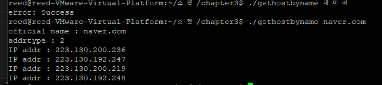
- ip주소->도메인이름(gethostbyaddr)
    ```c
    
    #include <stdio.h>
    #include <unistd.h>
    #include <arpa/inet.h>
    #include <netdb.h>
    #include <string.h>

    void main(int argc, char** argv)
    {
            struct hostent* host;
            struct sockaddr_in  addr;

            memset(&addr, 0, sizeof(addr));
            addr.sin_addr.s_addr =  inet_addr(argv[1]);
            host = gethostbyaddr(&addr.sin_addr, sizeof(addr.sin_addr),AF_INET);

            printf("Hostname : %s\n", host->h_name);


    }

    ```
    - 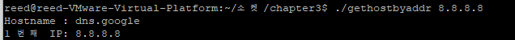
### 소켓옵션
#### 소켓 옵션 설정
- setsockopt()
```c
    #include <sys/types.h>
    #include <sys/socket.h>

    int setsockopt(
        int sock,
        int level,            //소켓레벨
        int optname,        //설정할 옵션의 이름
        const void *optval,   //설정할 옵션값 저장한 버퍼주소
        socklen_t optlen     //optval이 가리키는 버퍼의 길이
    );
```
- getsockopt()
```c
    #include <sys/types.h>
    #include <sys/socket.h>

    int getsockopt(
        int sock,
        int level,            //소켓레벨
        int optname,        //설정할 옵션의 이름
        void *optval,   //설정할 옵션값 저장한 버퍼주소
        socklen_t* optlen     //optval이 가리키는 버퍼의 길이
    );
```
#### 소켓 옵션의 종류

|level|optname|get|set|설명|
|:--:|:--:|:--:|:--:|:--:|
|SOL_SOCKET|SO_KEEPALIVE|O|O|주기적으로 연결상태 확인 여부|
|SOL_SOCKET|SO_REUSEADDR|O|O|지역주소 재사용 여부|
|IPPROTO_TCP|TCP_NODELAY|O|O|Nagle알고리즘 비활성화 여부<br/>(기본값은 0;Nagle알고리즘 활성 상태)|


- TCP 소켓의 송수신 버퍼 크기(SO_SNDBUF, SO_RCVBUF)를 조회하고, 수신 버퍼 크기를 변경하는 것
    ```c
    #include <stdio.h>
    #include <stdlib.h>
    #include <unistd.h>
    #include <sys/socket.h>


    int main()
    {

            int sock;
            int sndbuf, rcvbuf;
            socklen_t optlen;

            sock = socket(PF_INET, SOCK_STREAM, 0);

            optlen = sizeof(sndbuf);
            if (getsockopt(sock, SOL_SOCKET, SO_SNDBUF, (void*)&sndbuf, &optlen)<0)
                    perror("getsockopt failed");
            printf("sendbuf size: %d\n", sndbuf);

            optlen = sizeof(rcvbuf);
            if (getsockopt(sock, SOL_SOCKET, SO_RCVBUF, (void*)&rcvbuf, &optlen)< 0 )
                    perror("getsockopt failed");
            printf("rcvbuf size : %d\n", rcvbuf);


            /*setsockopt*/
            rcvbuf = 8192;
            if (setsockopt(sock, SOL_SOCKET, SO_RCVBUF, &rcvbuf, sizeof(rcvbuf))<0)
                    perror("setsocketopt failed");
            printf("set rcvbuf size : %d\n", rcvbuf);
            return 0;
    }
    ```
- SO_REUSEADDR의 사용 예제
    - [./소켓/chapter2]의 base_server을 2번째 실행할 때, 아래와 같은 에러가 발생한다.
    - 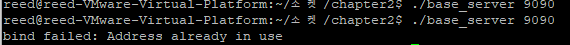
    - 해결방법 - SO_REUSEADDR
        ```C
        //여기서 enable = 1은 옵션을 켜라(활성화해라) 는 뜻입니다.
        //반대로 enable = 0을 넘기면 옵션을 끄는 것이 됩니다.
        int enable = 1;  
        setsockopt(server_fd, SOL_SOCKET, SO_REUSEADDR, &enable, sizeof(enable));
        if (bind(server_fd, (struct sockaddr*)&server_addr, sizeof(server_addr)) == -1 )

        ```
    - SO_REUSEADDR의 역할
        - TIME_WAIT 상태 중에도 동일한 포트를 재사용할 수 있도록 허용.
        - 즉, bind() 호출이 실패하지 않고, 서버를 즉시 재시작할 수 있게 해줍니다.
### 멀티프로세서 , 멀티프로세스
- 멀티프로세서 - 컴퓨터 시스템에 여러 개의 CPU가 있는 구조 ,멀티프로세서 시스템에서는 fork()로 만든 프로세스들이 서로 다른 CPU에서 동시에 실행될 수 있어요.
- 멀티프로세스 - 운영체제에서 여러 개의 프로세스를 동시에 실행하는 소프트웨어 개념


#### fork
- 현재 실행 중인 프로세스를 복사해서 새로운 프로세스(자식)를 생성합니다.
- 이때 부모와 자식 프로세스는 거의 완전히 똑같은 메모리 상태로 실행을 시작합니다.
- 단, 두 프로세스는 독립적으로 실행되며, 이후 각각 다른 행동을 할 수 있습니다.
- `부모 프로세스에겐 자식의 PID가 리턴됨, 자식 프로세스에겐 0이 리턴됨`
- 유닉스/Linux 계열에서 unistd.h에 정의됨

```C
#include <stdio.h>
#include <unistd.h>
int globalval = 10 ;

int main()
{
        pid_t pid;
        int localval = 20;

        globalval++;   //11
        localval +=5;   //25

        pid = fork();            
        if(pid==0)
        {
                globalval+=2;  //13
                localval+=2;    //27
        }
        else
        {
                globalval-=2;    //9
                localval -=2;    //23
        }

        if (pid==0)
        {
                printf("child proc[%d, %d]\n", globalval, localval);
        }
        else
        {
                printf("parent proc [%d, %d]\n", globalval, localval);
        }

        return 0;
}

```
- 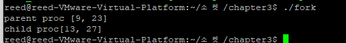
- 부모가 먼저 보통 출력되는 이유
    - 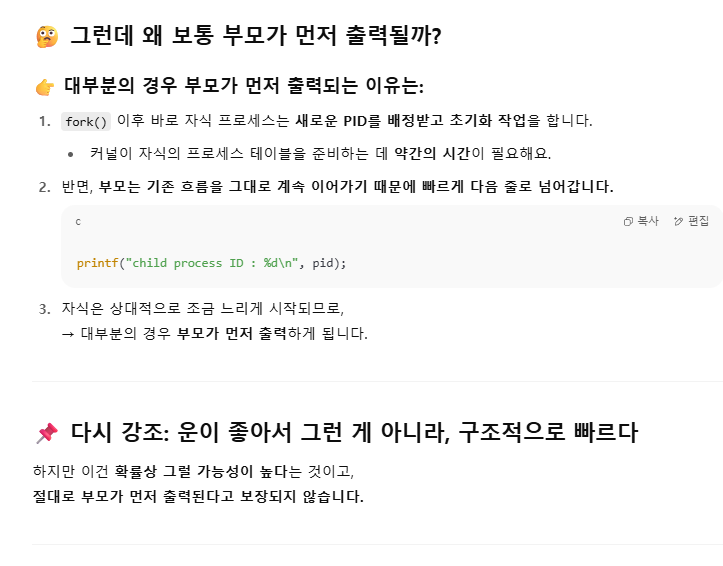
#### 좀비 프로세스
- 자식 프로세스가 exit()으로 종료는 되었지만, 부모 프로세스가 아직 그 종료 상태(exit status)를 회수하지 않은 상태에서
커널에 프로세스 정보가 남아 있는 프로세스

1. 좀비 프로세스 만들기 위한 코드


    ```c

    #include <stdio.h>
    #include <unistd.h>

    int main()
    {

            pid_t pid= fork();

            if(pid ==0)
            {
                    puts("Hi , I'm Child process");
            }
            else
            {
                    printf("child process ID : %d\n", pid);
                    sleep(30);   //부모는 30초 뒤에  puts("end parent process");을 하게 된다.
            }

            if (pid ==0)
            {
                    puts("end child process");
            }
            else
            {
                    puts("end parent process");
            }
            return 0;
    }

    ```
2. 좀비 프로세스 확인하기 위한 코드
    ```c
    $ ps au

    ```
    - 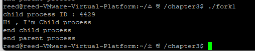
    - 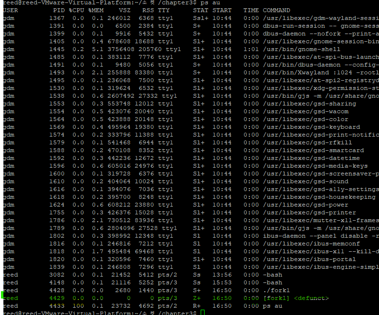

3. 좀비 프로세스 해결 방법: wait() ,waitpid(),sigaction(), signal
    - waitpid()는 wait()보다 더 유연하게 동작합니다:
    ```C
    pid_t waitpid(pid_t pid, int *status, int options);
    ```
    |인자|설명|
    |:--:|:--:|
    |pid|어떤 자식을 기다릴지 지정 (특정 pid, -1이면 아무 자식이나)|
    |status|자식 종료 상태를 저장할 변수|
    |options|옵션 (0, WNOHANG 등)|

4. waitpid()의 비동기(논블로킹) 대기  (1)

|전체 흐름 설명|
|:--:|
|fork()로 자식 생성|
|자식은 15초 후 return 24로 종료 (즉, exit(24)와 같음)|
|부모는 waitpid()를 WNOHANG 옵션으로 호출해서 자식 종료 여부만 확인|
|자식이 아직 안 죽었으면 → 0 반환|
|자식이 죽었으면 → 자식 PID 반환|
|자식이 종료되면 WIFEXITED(status) 확인 후, WEXITSTATUS(status)로 종료 코드 출력|

```c
#include <stdio.h>
#include <unistd.h>
#include <sys/wait.h>


int main()


{
        pid_t pid =fork();
        int status;

        if (pid ==0)
        {
                sleep(15);
                return 24;
        }
        else
        {
                //자식 프로세스가 아직 종료되지 않았으면 waitpid()는 0을 반환하고,
                //부모는 3초 간격으로 "sleep 3sec"을 출력하면서 계속 자식의 종료를 비동기적으로 체크합니다.
                while(!waitpid(-1 , &status, WNOHANG))   
                {
                        sleep(3);
                        puts("sleep 3sec");
                }
                if(WIFEXITED(status))
                {
                        printf("child send %d\n", WEXITSTATUS(status));
                }
        }
        return 0;

}

```
- 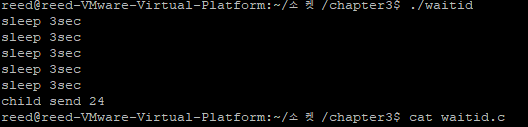

5. waitpid()의 비동기(논블로킹) 대기 (2)
- fork()를 두 번 사용해서 두 개의 자식 프로세스를 만들고, wait()를 두 번 호출하여 두 자식 프로세스의 종료 상태를 확인하는 구조예요.

```c
#include <stdio.h>
#include <sys/wait.h>
#include <unistd.h>
#include <stdlib.h>

int main() {
    int status;
    pid_t pid = fork();

    if (pid == 0) return 3;              // 첫 번째 자식: return 3 → exit(3)
    else {
        printf("child pid: %d\n", pid);

        pid = fork();                    // 두 번째 자식 생성
        if (pid == 0) exit(7);           // 두 번째 자식: exit(7)
        else {
            printf("child pid : %d\n", pid);

            wait(&status);               // 첫 번째 자식 or 두 번째 자식 기다림
            if (WIFEXITED(status)) 
                printf("child send one: %d\n", WEXITSTATUS(status));

            wait(&status);               // 나머지 자식 기다림
            if (WIFEXITED(status)) 
                printf("child send two: %d\n", WEXITSTATUS(status));

            sleep(30);                   // 부모는 30초 동안 살아 있음
        }
    }
    return 0;
}


```
- 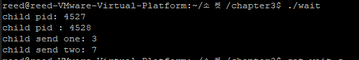
## 102일차(7/3) 
### 멀티프로세서 , 멀티프로세스 [./소켓/chapter4]
#### 좀비 프로세스
- 좀비 프로세스 해결 방법: wait() ,waitpid(),sigaction(), signal
6. signal() 함수
- 부모 프로세스가 자식 프로세스의 종료를 감지하고 처리하도록 설정할 수 있습니다.
- signal 함수 구조 분석
    ```c
    void (*signal(int signum, void (*handler)(int)))(int);
    ```
    - int signum - 감지할 시그널 번호 , 예: SIGINT, SIGCHLD, SIGKILL 등
    - void (*handler)(int) - 시그널이 발생했을 때 실행될 콜백 함수 포인터입니다.
- signal(), alarm(), 그리고 시그널 처리기를 사용하여 주기적으로 "timeout~" 메시지를 출력하는 간단한 예제
```c
#include <stdio.h>
#include <unistd.h>
#include <signal.h>


void timeout(int sig)
{
        if (sig==SIGALRM) puts("timeout~");
        alarm(2);
}

void main()
{

        signal(SIGALRM, timeout);
        alarm(2);  //2초 뒤 SIGALRM발생

        for (int i=0; i<5 ; i++)
        {
                puts("wait...");
                sleep(100);
        }
}  
```
- 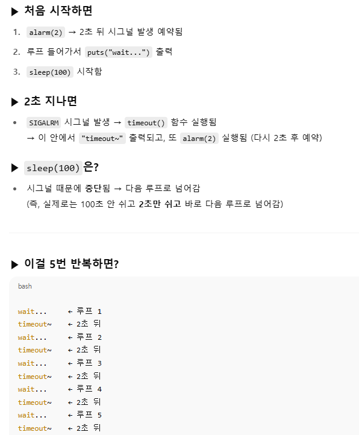

- signal()은 "시그널 번호와 핸들러 함수"를 인자로 받고, 이전 핸들러 함수를 포인터로 반환하는 함수입니다.
    ```c
    #include <stdio.h>
    #include <signal.h>

    void handler1(int signo) {
        printf("handler1: 시그널 %d 처리\n", signo);
    }

    void handler2(int signo) {
        printf("handler2: 시그널 %d 처리\n", signo);
    }

    int main() {
        // 처음으로 handler1을 등록
        void (*old_handler)(int);
        old_handler = signal(SIGINT, handler1);
        
        // 이때 old_handler는 이전 핸들러, 대부분 SIG_DFL (기본값)

        // 다시 handler2로 덮어쓰기
        void (*prev_handler)(int);
        prev_handler = signal(SIGINT, handler2);

        // 이때 prev_handler는 handler1을 가리킴
        // 즉, 이전에 등록된 handler1 포인터가 반환된 것

        return 0;
    }

    ```

7. sigaction() 함수
- 기본 사용법
    ```c
    #include <signal.h>

    int sigaction(int signum, const struct sigaction *act, struct sigaction *oldact);

    ```
    - signum - 설정할 시그널 번호 (SIGINT, SIGALRM, 등)
    - act - 새로 설정할 동작 (핸들러 등 포함)
    - oldact - 이전 시그널 동작 정보를 저장 (NULL이면 무시)
- 구조체: struct sigaction
    ```c
    struct sigaction {
    void (*sa_handler)(int);  // 시그널 핸들러 함수
    sigset_t sa_mask;         // 시그널 처리 중 블록할 시그널들
    int sa_flags;             // 동작 제어 옵션 (예: SA_RESTART 등)
    };
    ```
#### pipe() 함수 
- 데이터를 한 방향으로 전달하는 통신 채널(파이프)을 만드는 함수 
- 함수원형
    ```c
    #include <unistd.h>
    int pipe(int pipefd[2]);
    ```
    - pipefd[0]: 파이프의 읽기(read) 끝
    - pipefd[1]: 파이프의 쓰기(write) 끝

- 동작 원리
    - pipe()를 호출하면 커널이 두 개의 연결된 파일 디스크립터를 만듭니다.
    - 한쪽 끝(pipefd[1])에 데이터를 쓰면, 다른 쪽 끝(pipefd[0])에서 그 데이터를 읽을 수 있어요.
    - `단방향 통신입니다. (읽기→쓰기 방향)`
- pipe()와 fork()를 사용해서 부모 프로세스와 자식 프로세스 간에 메시지를 전달하는 간단한 예제(1)
    ```c
    #include <stdio.h>
    #include <unistd.h>

    int main()
    {
            int fds[2];
            char str[] =  "Who are you?";
            char buf[30];
            pid_t pid;

            pipe(fds);
            pid = fork();

            if (pid ==0 ) write(fds[1], str, sizeof(str));
            else
            {
                    read(fds[0],buf, sizeof(buf));
                    puts(buf);
            }
            return 0;
    }

    ```
    - 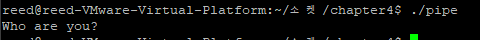
    - 
- pipe()와 fork()를 사용해서 부모 프로세스와 자식 프로세스 간에 메시지를 전달하는 pipe1개 사용하는 예제
    ```c
    #include <stdio.h>
    #include <unistd.h>

    int main()
    {
            int fds[2];
            char str[] = "Who are you?";
            char str2[] = "Thank you for your message";
            char buf[50];
            pid_t pid;

            pipe(fds);
            pid = fork();

            if (pid ==0 )
            {
                    write(fds[1], str, sizeof(str));
                    sleep(2);
                    read(fds[0], buf, sizeof(buf));
                    printf("child proc output :%s\n", buf);
            }
            else
            {
                    read(fds[0], buf, sizeof(buf));
                    printf("parent proc output :%s\n", buf);
                    write(fds[1], str2, sizeof(str2));
                    sleep(3);
            }
            return 0;
    }
    ```
    - 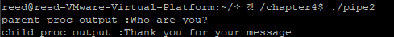
    - 

- pipe()와 fork()를 사용해서 부모 프로세스와 자식 프로세스 간에 메시지를 전달하는 pipe2개 사용하는 예제
    ```c
    #include <stdio.h>
    #include <unistd.h>

    int main()
    {
            int fds[2], fds2[2];
            char str[] = "Who are you?";
            char str2[] = "Thank you";
            char buf[30];
            pid_t pid;

            pipe(fds);
            pipe(fds2);
            pid = fork();

            if(pid==0)
            {
                    write(fds[1], str, sizeof(str));
                    read(fds2[0], buf, sizeof(buf));
                    printf("child prc result : %s\n", buf);
            }
            else
            {
                    read(fds[0], buf, sizeof(buf));
                    printf("parent prc result :%s\n", buf);
                    write(fds2[1], str2, sizeof(str2));
                    sleep(3);
            }

            return 0;
    }
    ```
    - 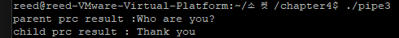
    - 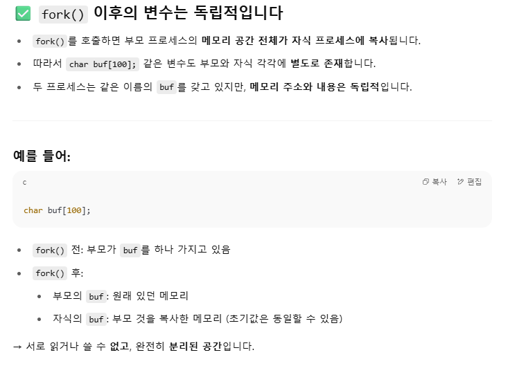

#### TCP 에코 서버 + 파일 기록
- 전체 요약
```
[서버 시작]
 ├─ pipe 생성
 ├─ 기록용 자식 fork
 ├─ sigaction 등록 (SIGCHLD → read_childproc)
 ├─ 서버 소켓 열기
 └─ 클라이언트 대기

[클라이언트 접속 시]
 ├─ 처리용 자식 fork
 │   ├─ 클라이언트와 메시지 주고받기
 │   └─ 메시지를 pipe로 기록용 자식에게 전달
 └─ 부모는 클라이언트 소켓 닫고 다음 클라이언트 대기

[기록용 자식]
 └─ pipe에서 메시지 10개 수신 후 파일 저장 → 종료

[자식 종료 시]
 └─ SIGCHLD 발생 → 핸들러에서 waitpid()로 회수 → 좀비 제거
```
- 서버코드

    |항목|설명|
    |:--:|:--:|
    |기록용 자식|메시지 10개 저장 후 종료. 그 뒤로는 echomsg.txt에 아무것도 기록 안 됨|
    |부모 (서버 루프)|계속해서 클라이언트 받음. 계속 동작|
    |처리용 자식|클라이언트 대응 후 종료.<br/>클라이언트로부터 메시지를 읽고, 그걸 다시 보내는 에코 서버 기능 수행<br/>동시에 해당 메시지를 pipe의 쓰기단 fds[1]에 기록|
   
    ```c

    #include <stdio.h>
    #include <unistd.h>
    #include <string.h>
    #include <stdlib.h>
    #include <arpa/inet.h>
    #include <signal.h>
    #include <sys/wait.h>
    #include <sys/socket.h>

    #define BUF_SIZE 100

    void read_childproc(int sig);

    int main(int argc, char** argv)
    {
            int serv_sock, clnt_sock;
            struct sockaddr_in serv_addr, clnt_addr;
            int fds[2];

            pid_t pid;
            struct sigaction act;
            socklen_t adr_sz;
            int str_len, state;
            char buf[BUF_SIZE];

            if (argc !=2)
            {
                    printf("Usage: %s <port> \n", argv[0]);
                    exit(1);
            }

            act.sa_handler= read_childproc;
            act.sa_flags=0;
            sigemptyset(&act.sa_mask);
            state = sigaction(SIGCHLD, &act, 0);

            serv_sock = socket(PF_INET, SOCK_STREAM, 0);
            memset(&serv_addr, 0, sizeof(serv_addr));
            serv_addr.sin_family = AF_INET;
            serv_addr.sin_addr.s_addr = htonl(INADDR_ANY);
            serv_addr.sin_port = htons(atoi(argv[1]));

            if(bind(serv_sock, (struct sockaddr*) &serv_addr, sizeof(serv_addr))==-1)
            {
                    perror("bind() error") ;
                    close(serv_sock);
                    exit(1);
            }
            if (listen(serv_sock, 5) == -1)
            {
                    perror("listen() error");
                    close(serv_sock);
                    exit(1);
            }

            pipe(fds);
            pid =fork();

            if(pid ==0 )
            {       //메시지 기록전용 자식 프로세스
                    FILE *fp = fopen("echomsg.txt", "wt");
                    char msgbuf[BUF_SIZE];
                    int i, len;
                    for (i = 0 ; i<10 ; i++)
                    {
                            len = read(fds[0], msgbuf, BUF_SIZE);
                            fwrite((void*)msgbuf, 1, len, fp);
                    }
                    fclose(fp);
                    return 0;
            }

            while (1)
            {

                    adr_sz = sizeof(clnt_sock);
                    clnt_sock = accept(serv_sock, (struct sockaddr*)&clnt_addr , &adr_sz);
                    if (clnt_sock ==-1)
                            continue;
                    else
                            puts("new clinent connected...");

                    pid=fork();
                    if(pid ==0)
                    {

                            close(serv_sock);
                            while((str_len = read(clnt_sock, buf, BUF_SIZE)) >0)
                            {
                                    write(clnt_sock, buf, str_len);
                                    write(fds[1], buf, str_len);
                            }
                            close(clnt_sock);
                            puts("client disconnected...");
                            return 0;
                    }
                    else

                    {
                            close(clnt_sock);
                    }
            }
            close(serv_sock);
            return 0;

    }

    void read_childproc(int sig)
    {

            pid_t pid;
            int status;
            pid = waitpid(-1, &status, WNOHANG);
            printf("removed proc id : %d \n", pid);
    }


    ```
- 서버 코드에서 처리용 자식 문제점
    - for (i = 0; i < 10; i++)	메시지를 10개만 읽고 파일 기록 후 종료
    - 기록용 자식이 종료되면 pipe의 읽기 단 fds[0]이 닫힘
    - 그런데 처리용 자식은 계속 fds[1]에 write() 시도함
    - pipe의 읽기 쪽이 모두 닫히면 write()는 SIGPIPE 시그널 발생 또는 write()가 -1 반환 (에러)
    - 파이프에 쓰기는 실패하고, 더 이상 메시지는 기록되지 않음.심지어 처리용 자식이 비정상 종료될 수도 있음
    - 해결책
        ```c
        // 잘못된: 10개만 읽음
         pid =fork();

        if(pid ==0 )
        {   //메시지 기록전용 자식 프로세스
            FILE *fp = fopen("echomsg.txt", "wt");
            char msgbuf[BUF_SIZE];
            int i, len;
            for (i = 0 ; i<10 ; i++)
            {
                    len = read(fds[0], msgbuf, BUF_SIZE);
                    fwrite((void*)msgbuf, 1, len, fp);
            }
            fclose(fp);
            return 0;
        }


        // 올바른: 무한히 읽음
        // 기록용 자식 프로세스 (무한히 기록)
        pid = fork();
        if (pid == 0) {
            FILE *fp = fopen("echomsg.txt", "wt");
            char msgbuf[BUF_SIZE];
            int len;

            while (1) {
                len = read(fds[0], msgbuf, BUF_SIZE);
                if (len <= 0)
                    break;
                fwrite(msgbuf, 1, len, fp);
                fflush(fp); // 바로 기록
            }

            fclose(fp);
            return 0;
        }

        ```

### IO 멀티 플렉싱
- 멀티프로세서 단점
    - 프로세서의 빈번한 생성으로 성능저하 발생
    - 멀티프로세서의 흐름 구현의 어려움
    - 프로세서간 통신이 필요한 경우 구현이 복잡
    - 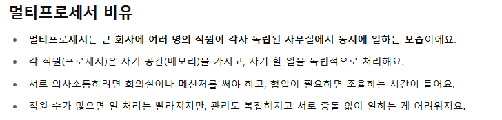
- IO 멀티 플렉싱 
    - 하나의 프로세서로 다수의 클라이언트에게 서비스를 제공한다.
    - 하나의 프로세서가 여러개의 소켓을 핸들링해야 한다.
    - 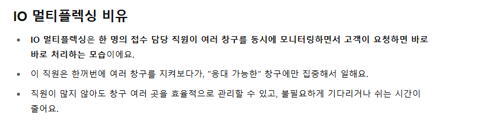

#### SELECT
- fd_set 구조체
    - 파일 디스크립터 집합을 관리하는 자료구조(비트마스크 형태)
    - 최대 FD_SETSIZE 개수만큼 파일 디스크립터를 담을 수 있음 (보통 1024)
    - select()에 어떤 fd들을 감시할지 알려주고,
    - select()가 반환한 뒤에는 어떤 fd가 이벤트가 발생했는지 확인할 때 사용
    - 주요 매크로 함수들

        |함수/매크로|역할|
        |:--:|:--:|
        |FD_ZERO(fd_set *set)|집합 초기화 (빈 집합으로 만듦)|
        |FD_SET(int fd, fd_set *set)|특정 fd를 집합에 추가|
        |FD_CLR(int fd, fd_set *set)|특정 fd를 집합에서 제거|
        |FD_ISSET(int fd, fd_set *set)|특정 fd가 집합에 포함되어 있는지(이벤트 발생 여부 확인)|


- select()함수
    - 여러 개의 파일 디스크립터(소켓, 파일 등)를 한 번에 감시해서,
    - 읽기/쓰기/예외 상황이 발생한 디스크립터를 알려줍니다.
    ```c
    #include <sys/select.h>

    int select(int nfds,
            fd_set *readfds,
            fd_set *writefds,
            fd_set *exceptfds,
            struct timeval *timeout);
    ```
    |매개변수|설명|
    |:--:|:--:|
    |nfds|감시할 파일 디스크립터 중 최대값 + 1|
    |readfds|읽기 가능 여부를 감시할 fd 집합 (읽기 이벤트)|
    |writefds|쓰기 가능 여부를 감시할 fd 집합 (쓰기 이벤트)|
    |exceptfds|예외 조건(에러 등)을 감시할 fd 집합|
    |timeout|타임아웃 값<br/>NULL: 무한 대기<br/>0으로 설정하면 논블로킹 호출(즉시 리턴)<br/>특정 시간 설정 가능|

    |반환 값|
    |:--:|
    |이벤트가 발생한 fd의 개수 (0 이상)|
    |타임아웃에 도달하면 0 반환|
    |오류 발생 시 -1 반환|

- select() 시스템 호출을 이용해서 표준 입력(파일 디스크립터 0)을 감시하고, 5초 동안 입력이 없으면 "time-out"을 출력
    - 표준 입력(STDIN, 키보드 입력)을 감시
    - 입력이 들어오면 즉시 읽고 출력
    - 아무 입력이 없으면 5초 뒤 "time-out" 출력
    - 오류가 발생하면 종료


    ```c

    #include <stdio.h>
    #include <unistd.h>
    #include <sys/time.h>
    #include <sys/select.h>

    #define BUF_SIZE 30
    int main()
    {
            fd_set reads, temps;  //temps: select() 호출에 사용될 임시 복사본 (왜냐하면 select()는 이 값을 변경함)
            int result, str_len;
            char buf[BUF_SIZE];
            struct timeval timeout;

            FD_ZERO(&reads);
            FD_SET(0, &reads);   // 0번 FD = stdin

            while(1)
            {
                    temps = reads;
                    timeout.tv_sec=5;
                    timeout.tv_usec =0;
                    result = select(1, &temps, 0,0,&timeout);


                    if(result == -1)
                    {
                            puts("select() error");
                            break;
                    }
                    else if (result == 0) puts("time-out");
                    else
                    {
                            if(FD_ISSET(0, &temps))
                            {
                                    str_len = read(0, buf, BUF_SIZE);
                                    buf[str_len] = '\0';
                                    printf("message from consol: %s", buf);
                            }
                    }
            }
            return 0;
    }

    ```
    - 
    - 

-  select()를 이용한 간단한 에코 서버 , 클라이언트
    - 서버
    ```c
    
    #include <stdio.h>
    #include <stdlib.h>
    #include <string.h>
    #include <arpa/inet.h>
    #include <sys/select.h>
    #include <unistd.h>
    #include <sys/time.h>
    #include <sys/socket.h>

    #define BUF_SIZE 100

    void error_handling(char *buf);

    int main(int argc, char* argv[])
    {
            int serv_sock, clnt_sock;
            struct sockaddr_in serv_adr, clnt_adr;
            struct timeval timeout;
            fd_set reads, cpy_reads;

            socklen_t adr_sz;
            int fd_max, str_len, fd_num , i;
            char buf[BUF_SIZE];

            if (argc !=2)
            {
                    printf("Usage: %s <port> \n" , argv[0]);
                    exit(1);
            }

            serv_sock = socket(PF_INET, SOCK_STREAM, 0);
            memset(&serv_adr, 0, sizeof(serv_adr));
            serv_adr.sin_family = AF_INET;
            serv_adr.sin_addr.s_addr = htonl(INADDR_ANY);
            serv_adr.sin_port = htons(atoi(argv[1]));

            if (bind(serv_sock, (struct sockaddr*) &serv_adr, sizeof(serv_adr)) == -1)
            {
                    error_handling("bind() error");
            }
            if (listen(serv_sock, 5) == -1 ) error_handling("listen() error");

            FD_ZERO(&reads);
            FD_SET(serv_sock, &reads);
            fd_max = serv_sock;

            while(1)
            {
                    cpy_reads =reads;
                    timeout.tv_sec =5;
                    timeout.tv_usec=5000;

                    if ((fd_num = select(fd_max +1 , &cpy_reads, 0, 0, &timeout))== -1) break;
                    if (fd_num =0 ) continue;
                    for (i=0 ; i<fd_max +1 ; i++)
                    {
                            if(FD_ISSET(i, &cpy_reads))
                            {
                                    if(i == serv_sock)
                                    //i번 FD가 서버 소켓이라면 ⇒ 새로운 클라이언트가 접속 요청한 것
                                    //이때는 accept() 호출해서 연결을 수락해야 합니다.
                                    {
                                            adr_sz = sizeof(clnt_adr);
                                            clnt_sock = accept(serv_sock, (struct sockaddr*)&clnt_adr, &adr_sz);
                                            FD_SET(clnt_sock, &reads);
                                            if (fd_max < clnt_sock)
                                            {

                                                    fd_max = clnt_sock;
                                            }
                                            printf("connected client :%d \n" , clnt_sock);

                                    }
                                    else
                                    {       //i번 FD가 클라이언트 소켓일 때 (서버 소켓이 아님)
                                            str_len = read(i, buf, BUF_SIZE);
                                            if(str_len ==0 )
                                            {
                                                    FD_CLR(i, &reads);
                                                    close(i);
                                                    printf("closed client : %d\n", i);
                                            }
                                            else
                                            {       // 에코 처리
                                                    write( i,buf, str_len);
                                            }
                                    }

                            }
                    }

            }
            close(serv_sock);
            return 0;
    }


    void error_handling(char* buf)
    {

            fputs(buf, stderr);
            fputc('\n', stderr);
            exit(1);
    }

    ```
    - 클라이언트
    ```c
    
    #include <stdio.h>
    #include <unistd.h>
    #include <stdlib.h>
    #include <string.h>
    #include <arpa/inet.h>
    #include <sys/socket.h>


    #define BUF_SIZE 1024

    void error_handling(char* message);

    int main(int argc, char** argv)
    {
            int sock;
            char message[BUF_SIZE];
            int str_len;
            struct sockaddr_in serv_adr;

            if( argc !=3)
            {
                    printf("Usage : %s <IP> <port> \n", argv[0]);
                    exit(1);
            }

            sock = socket(PF_INET, SOCK_STREAM, 0);
            if( sock == -1) error_handling("socket() failed");

            memset(&serv_adr, 0, sizeof(serv_adr));
            serv_adr.sin_family = AF_INET;
            serv_adr.sin_addr.s_addr = inet_addr(argv[1]);
            serv_adr.sin_port = htons(atoi(argv[2]));

            if(connect(sock,(struct sockaddr*)  &serv_adr , sizeof(serv_adr)  ) == -1 ) error_handling("connect() failed");
            else puts("connected...");

            while(1)
            {
                    fputs("Input message (Q to quit):  ", stdout);
                    fgets(message , BUF_SIZE, stdin);

                    if (!strcmp(message , "q\n" ) || !strcmp(message, "Q\n")) break;

                    write(sock, message, strlen(message));   //입력한 메시지를 서버에 전송
                    str_len = read(sock, message, BUF_SIZE);   //서버로부터 받은 응답 출력 (에코 서버일 경우, 같은 메시지가 돌아옴)
                    message[str_len] = '\0';
                    printf("Message from server : %s ", message);

            }
            close(sock);
            return 0;

    }

    void error_handling(char *message)
    {
            fputs(message, stderr);
            fputc('\n', stderr);
            exit(1);

    }


    ```
    - 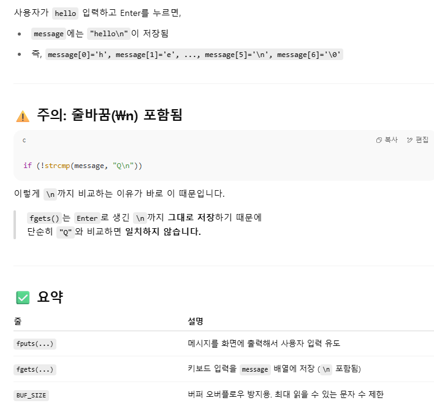
    - 
- **VM 외부 접속 가능하게 하려면 필요한 작업**
    1. vm - edit - virtual network editor 
    2. VMnet8 - change setting
    3. VMnet8 - net settings
    4. add
        - 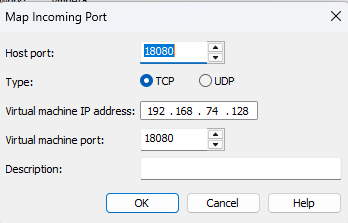
    5. 서버 컴퓨터 기준
        - 
    6. 클라이언트 컴퓨터 기준
        ```c
        ./echo_client 서버ip 서버포트번호
        ```
    7. 실행확인
        - 내가 서버일 때 
            ```c
            ./echo_selectsv 18080
            ```
            - 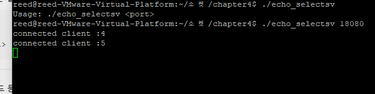
        - 내가 클라이언트일 때
            ```c
            ./echo_client 서버ip 18080
            ```
            -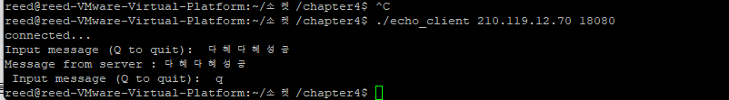    
        - 내가 서버이자 클라이언트일 때 + 서버에서 클라이언트가 보낸 메시지 출력
            ```c
           for (i=0 ; i<fd_max +1 ; i++)
                    {
                            if(FD_ISSET(i, &cpy_reads))
                            {
                                    if(i == serv_sock)
                                    //i번 FD가 서버 소켓이라면 ⇒ 새로운 클라이언트가 접속 요청한 것
                                    //이때는 accept() 호출해서 연결을 수락해야 합니다.
                                    {
                                            adr_sz = sizeof(clnt_adr);
                                            clnt_sock = accept(serv_sock, (struct sockaddr*)&clnt_adr, &adr_sz);
                                            FD_SET(clnt_sock, &reads);
                                            if (fd_max < clnt_sock)
                                            {

                                                    fd_max = clnt_sock;
                                            }
                                            printf("connected client :%d \n" , clnt_sock);

                                    }
                                    else
                                    {       //i번 FD가 클라이언트 소켓일 때 (서버 소켓이 아님)
                                            str_len = read(i, buf, BUF_SIZE);
                                            if(str_len ==0 )
                                            {
                                                    FD_CLR(i, &reads);
                                                    close(i);
                                                    printf("closed client : %d\n", i);
                                            }
                                            else
                                            {       
                                                    printf("Message from client %d: %s", i, buf); // 메시지 출력              
                                                    // 에코 처리
                                                    write( i,buf, str_len);
                                            }
                                    }

                            }
                    }
            ```
            - 

- 서버 프로그램을 실행할 때 갑자기 bind() error가 나는 이유는 대부분 포트가 아직 "사용 중"이기 때문입니다.
    - 원인: 이전 서버가 포트를 완전히 반환하지 않음
    - 리눅스에서는 서버를 강제로 종료했을 경우(예: Ctrl+C), 바인딩된 포트가 즉시 해제되지 않고 잠시 동안 TIME_WAIT 상태로 남아 있게 됩니다. 그래서 다시 같은 포트(18080)로 bind() 하려 하면 에러가 납니다.
    - 이건 리눅스의 TCP 포트 보호 메커니즘 때문에 발생하는 일반적인 현상입니다.

## 103일차(7/4) [./소켓/chapter5]
### IO 멀티 플렉싱
#### poll
- 

- struct pollfd 구조체
```c
struct pollfd {
    int   fd;         // 감시할 파일 디스크립터
    short events;     // 감시할 이벤트 (입력/출력 등)
    short revents;    // 실제 발생한 이벤트 (poll() 호출 후 설정됨)
};
```
- poll()함수
    - 함수정의
    ```c
    #include <poll.h>

    int poll(struct pollfd fds[], nfds_t nfds, int timeout);
    ``` 
    |매개변수|설명|
    |:--:|:--:|
    |fds[]|감시할 파일 디스크립터의 배열 (struct pollfd 구조체 배열)|
    |nfds|fds[] 배열의 길이 (파일 디스크립터 수)|
    |timeout|대기 시간 (밀리초 단위)<br> 0: 즉시 반환 (non-blocking)<br> -1: 무한 대기 (blocking)<br>>0: 지정된 밀리초만큼 대기|
    
    - 주요 이벤트 플래그 (events, revents에서 사용)

    |플래그|설명|
    |:--:|:--:|
    |POLLIN|읽을 수 있음 (입력 가능)|
    |POLLOUT|쓸 수 있음 (출력 가능)|
    |POLLERR|에러 발생|
    |POLLHUP|연결이 끊김 (hang up)|
    |POLLNVAL|잘못된 파일 디스크립터|
    
    - 반환값
    |반환값|의미|
    |:--:|:--:|
    |>0|이벤트가 발생한 파일 디스크립터 개수|
    |0|타임아웃 (이벤트 없음)|
    |-1|에러 발생 (errno로 확인)|

- poll() + 키보드(표준 입력, fd=0)의 입력
    ```c
    #include <stdio.h>
    #include <unistd.h>
    #include <poll.h>

    int main()
    {

            struct pollfd pfd;
            pfd.fd = STDIN_FILENO;  //0 표준입력
            pfd.events = POLLIN;

            printf("wait 5 seconds ...\n");
            int ret =poll(&pfd, 1, 5000);
            if(ret == -1) perror("poll() error\n");
            else if (ret ==0) perror("timeout\n");
            else
            {
                    if (pfd.revents & POLLIN)
                    {
                            char buffer[100];
                            fgets(buffer, sizeof(buffer), stdin);
                            printf("Entered: %s\n", buffer);
                    }
            }

            return 0;
    }
    ```
    - 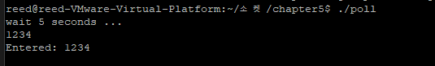

- poll() 서버 , 클라이언트 통신
    - 요점
        - poll()은 서버 소켓과 클라이언트 소켓들의 이벤트를 감시함
        - 서버 소켓이 읽기 가능해지면 → 새 클라이언트 연결 요청 수락(accept)
        - 클라이언트 소켓이 읽기 가능해지면 → 데이터 읽고, 0 이하일 경우 종료 처리
        - 클라이언트 종료 시 fd 목록에서 삭제 → 배열 뒷부분을 덮어써서 효율적으로 관리
        - nfds는 현재 감시 중인 소켓 개수
        
    - 서버
    ```c
    #include <stdio.h>
    #include <poll.h>
    #include <unistd.h>
    #include <string.h>
    #include <stdlib.h>
    #include <netinet/in.h>

    #define MAX_CLIENTS 100

    int main(int argc, char** argv)
    {
            int server_fd, client_fd;
            struct sockaddr_in addr;
            socklen_t addrlen =sizeof(addr);

            struct pollfd fds[MAX_CLIENTS];
            int nfds=1;

            server_fd = socket(PF_INET, SOCK_STREAM, 0);
            addr.sin_family = AF_INET;
            addr.sin_addr.s_addr = INADDR_ANY;
            addr.sin_port = htons(atoi(argv[1]));

            bind(server_fd, (struct sockaddr*) &addr, sizeof(addr));
            listen(server_fd, 5);

            fds[0].fd = server_fd;
            fds[0].events = POLLIN;

            while(1)
            {
                    int activity = poll(fds, nfds, -1); // 이벤트 대기 (무한)
                    if (fds[0].revents & POLLIN)  // 클라이언트가 새로 연결을 시도했을 때
                    {
                            client_fd = accept(server_fd, (struct sockaddr*)&addr, &addrlen);
                            if(nfds <MAX_CLIENTS)
                            {
                                    fds[nfds].fd = client_fd;
                                    fds[nfds].events = POLLIN;
                                    nfds++;
                            }
                            printf("connected client : %d\n", client_fd);
                    }

                      // 기존 클라이언트들 이벤트 확인
                    for (int i=1 ; i<nfds ; i++)
                    {
                            if(fds[i].revents & POLLIN)
                            {
                                    char buffer[1024] = {0};
                                    int read_len = read(fds[i].fd, buffer, sizeof(buffer));
                                    if (read_len <= 0) // 클라이언트 종료 혹은 에러 발생 시
                                    {       int closefd = fds[i].fd;
                                            close(closefd);
                                            fds[i] = fds[nfds -1 ];
                                            nfds--;
                                            i--;
                                            printf("closed client : %d\n", closefd);
                                    }
                                    else
                                    {  // 받은 데이터 출력 및 에코
                                            printf("client[%d] %s \n",fds[i].fd, buffer);
                                            write(fds[i].fd , buffer, read_len);
                                    }
                            }

                    }

            }


            return 0;
    }
    ```
    - 클라이언트
    ```c
    #include <stdio.h>
    #include <unistd.h>
    #include <stdlib.h>
    #include <string.h>
    #include <arpa/inet.h>
    #include <sys/socket.h>


    #define BUF_SIZE 1024

    void error_handling(char* message);

    int main(int argc, char** argv)
    {
            int sock;
            char message[BUF_SIZE];
            int str_len;
            struct sockaddr_in serv_adr;

            if( argc !=3)
            {
                    printf("Usage : %s <IP> <port> \n", argv[0]);
                    exit(1);
            }

            sock = socket(PF_INET, SOCK_STREAM, 0);
            if( sock == -1) error_handling("socket() failed");

            memset(&serv_adr, 0, sizeof(serv_adr));
            serv_adr.sin_family = AF_INET;
            serv_adr.sin_addr.s_addr = inet_addr(argv[1]);
            serv_adr.sin_port = htons(atoi(argv[2]));

            if(connect(sock,(struct sockaddr*)  &serv_adr , sizeof(serv_adr)  ) == -1 ) error_handling("connect() failed");
            else puts("connected...");

            while(1)
            {
                    fputs("Input message (Q to quit):  ", stdout);
                    fgets(message , BUF_SIZE, stdin);

                    if (!strcmp(message , "q\n" ) || !strcmp(message, "Q\n")) break;

                    write(sock, message, strlen(message));   //입력한 메시지를 서버에 전송
                    str_len = read(sock, message, BUF_SIZE);   //서버로부터 받은 응답 출력 (에코 서버일 경우, 같은 메시지가 돌아옴)
                    message[str_len] = '\0';
                    printf("Message from server : %s ", message);

            }
            close(sock);
            return 0;

    }

    void error_handling(char *message)
    {
            fputs(message, stderr);
            fputc('\n', stderr);
            exit(1);

    }
    ```
    - 실행
        - 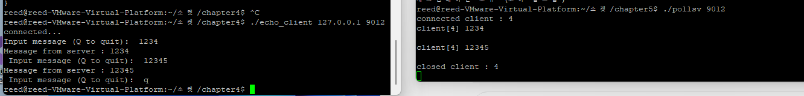
        - 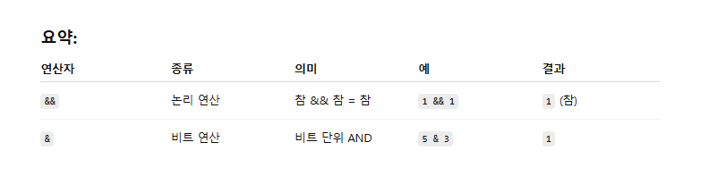
        - 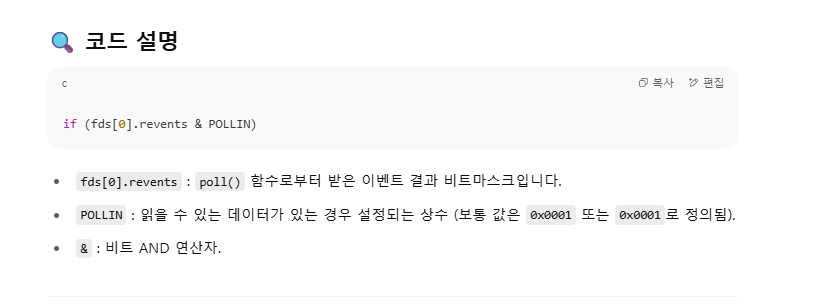

#### epoll
- select()와 poll()보다 훨씬 효율적으로 대규모 fd 감시 가능.
- 특히 수천, 수만 개 이상의 fd 처리에 적합합니다.

- 기본 사용 흐름 요약
    1. epoll_create1()으로 epoll 인스턴스 생성
    2. epoll_ctl()로 감시할 fd 등록
    3. epoll_wait()으로 이벤트 대기 및 처리
    4. 필요 시 epoll_ctl()로 fd 수정/삭제
    5. 작업 끝나면 close()로 epoll fd 닫기

- struct epoll_event
```c
typedef union epoll_data {
    void *ptr;
    int fd;
    uint32_t u32;
    uint64_t u64;
} epoll_data_t;

struct epoll_event {
    uint32_t events;      // 감시할 이벤트 종류 (EPOLLIN, EPOLLOUT 등)
    epoll_data_t data;    // 사용자 데이터 (보통 fd 저장)
};

```

- 주요 함수 원형
```c
// 1.epoll 인스턴스 생성
int epoll_create1(int flags);

// 2. epoll 감시 대상 등록/수정/삭제
//epfd : epoll_create 또는 epoll_create1로 생성된 epoll 인스턴스의 파일 디스크립터
// op (operation) :epoll 감시 대상에 대한 작업 종류
//EPOLL_CTL_ADD: fd 등록
//EPOLL_CTL_MOD: fd 이벤트 수정
//EPOLL_CTL_DEL: fd 삭제

//fd : 감시 대상이 되는 파일 디스크립터
//event :감시할 이벤트와 사용자 데이터를 담은 포인터. event->events에는 감시할 이벤트 플래그를 넣고, event->data에는 사용자 식별 데이터(주로 fd)를 넣음.
//반환값: 성공 시 0, 실패 시 -1
int epoll_ctl(int epfd, int op, int fd, struct epoll_event *event);

// 3. 이벤트 대기
int epoll_wait(int epfd, struct epoll_event *events, int maxevents, int timeout);

```

- 주요 상수 (events 플래그)

|상수|의미|
|:--:|:--:|
|EPOLLIN|읽기 가능|
|EPOLLOUT|쓰기 가능|
|EPOLLERR|에러 발생|
|EPOLLHUP|연결 종료|
|EPOLLET|엣지 트리거 모드 설정|
|EPOLLONESHOT|한 번만 이벤트 알림|


- epoll을 사용해서 키보드(표준 입력, fd=0)의 입력을 5초간 대기
    ```c

    #include <stdio.h>
    #include <unistd.h>
    #include <sys/epoll.h>
    #include <fcntl.h>

    int main()
    {
            int epfd = epoll_create1(0);
            struct epoll_event  event, events[10];

            event.events =EPOLLIN;
            event.data.fd = 0;

            epoll_ctl(epfd, EPOLL_CTL_ADD, 0, &event);

            printf("키보드 입력 대기중...\n");

            int n = epoll_wait(epfd, events, 10, 5000);   //events 배열에 최대 10개 이벤트를 저장할 수 있습니다. 반환값 n은 발생한 이벤트 개수입니다.
            if (n==0) printf("timeout\n");
            else if(n>0)
            {
                    printf("n: %d\n", n);
                    char buf[100];
                    fgets(buf, sizeof(buf), stdin);
                    printf("입력됨:%s\n ", buf);
            }
            close(epfd);
            return 0;
    }
    ```
    - 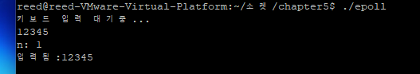

- epoll() 서버, 클라이언트
    - 서버
    ```c
    #include <stdio.h>
    #include <stdlib.h>
    #include <string.h>
    #include <unistd.h>
    #include <sys/epoll.h>
    #include <netinet/in.h>


    #define MAX_EVENTS 10   //MAX_EVENTS가 10이라는 것은 “한 번에 최대 10개의 이벤트를 처리할 준비가 되어 있다”는 뜻이

    int main(int argc, char* argv [])
    {
            int server_fd, epfd, client_fd, event_cnt;
            struct sockaddr_in addr;
            socklen_t addrlen = sizeof(addr);
            struct epoll_event ev, events[MAX_EVENTS];

            server_fd = socket(PF_INET, SOCK_STREAM, 0);
            addr.sin_family = AF_INET;
            addr.sin_addr.s_addr = INADDR_ANY;
            addr.sin_port = htons(atoi(argv[1]));

            if (bind(server_fd, (struct sockaddr*)&addr, sizeof(addr) ) == -1)
            {
                    perror("bind() failed");
                    close(server_fd);
                    exit(1);
            }
            if (listen(server_fd, 5) == -1)
            {
                    perror("listen() failed");
                    close(server_fd);
                    exit(1);
            }

            epfd = epoll_create1(0);
            ev.events = EPOLLIN;
            ev.data.fd = server_fd;

            epoll_ctl(epfd, EPOLL_CTL_ADD, server_fd, &ev);

            while(1)
            {

                    event_cnt = epoll_wait(epfd, events , MAX_EVENTS, 5000);
                    if (event_cnt == -1)
                    {
                            perror("epoll_wait() failed");
                            break;
                    }
                    for (int i= 0 ; i<event_cnt ; i++)
                    {
                            if(events[i].data.fd == server_fd)
                            {
                                    client_fd = accept(server_fd, (struct sockaddr*)&addr ,&addrlen);
                                    ev.events = EPOLLIN;
                                    ev.data.fd = client_fd;
                                    epoll_ctl(epfd, EPOLL_CTL_ADD, client_fd, &ev);
                                    printf("connected client : %d\n", client_fd);
                            }
                            else
                            {
                                    char buffer[1024] = {0};
                                    int read_len = read (events[i].data.fd, buffer, sizeof(buffer));
                                    if (read_len <=0)
                                    {
                                            epoll_ctl(epfd, EPOLL_CTL_DEL, events[i].data.fd, NULL);
                                            close(events[i].data.fd);
                                            printf("closed client:%d\n", events[i].data.fd);
                                    }

                                    else
                                    {
                                            printf("client [%d]  %s \n", events[i].data.fd, buffer);
                                            write(events[i].data.fd, buffer, read_len);
                                    }
                            }
                    }
            }
            close(server_fd);
            close(epfd);
            return 0;
    }

    ```
    - 클라이언트
    ```c
        #include <stdio.h>
        #include <unistd.h>
        #include <stdlib.h>
        #include <string.h>
        #include <arpa/inet.h>
        #include <sys/socket.h>


        #define BUF_SIZE 1024 

        void error_handling(char* message);

        int main(int argc, char** argv)
        {
                int sock;
                char message[BUF_SIZE];
                int str_len;
                struct sockaddr_in serv_adr;

                if( argc !=3)
                {
                        printf("Usage : %s <IP> <port> \n", argv[0]);
                        exit(1);
                }

                sock = socket(PF_INET, SOCK_STREAM, 0);
                if( sock == -1) error_handling("socket() failed");

                memset(&serv_adr, 0, sizeof(serv_adr));
                serv_adr.sin_family = AF_INET;
                serv_adr.sin_addr.s_addr = inet_addr(argv[1]);
                serv_adr.sin_port = htons(atoi(argv[2]));

                if(connect(sock,(struct sockaddr*)  &serv_adr , sizeof(serv_adr)  ) == -1 ) error_handling("connect() failed");
                else puts("connected...");

                while(1)
                {
                        fputs("Input message (Q to quit):  ", stdout);
                        fgets(message , BUF_SIZE, stdin);

                        if (!strcmp(message , "q\n" ) || !strcmp(message, "Q\n")) break;

                        write(sock, message, strlen(message));   //입력한 메시지를 서버에 전송
                        str_len = read(sock, message, BUF_SIZE);   //서버로부터 받은 응답 출력 (에코 서버일 경우, 같은 메시지가 돌아옴)
                        message[str_len] = '\0';
                        printf("Message from server : %s ", message);

                }
                close(sock);
                return 0;

        }

        void error_handling(char *message)
        {
                fputs(message, stderr);
                fputc('\n', stderr);
                exit(1);

        }
    ```
    - 실행
        - 

### 멀티캐스트, 브로드캐스트
- 브로드캐스트(Broadcast)와 멀티캐스트(Multicast)는 둘 다 "하나의 송신자가 여러 수신자에게 데이터를 보내는" 통신 방식이지만, 작동 방식과 사용 목적에 있어 중요한 차이점이 있습니다.
- 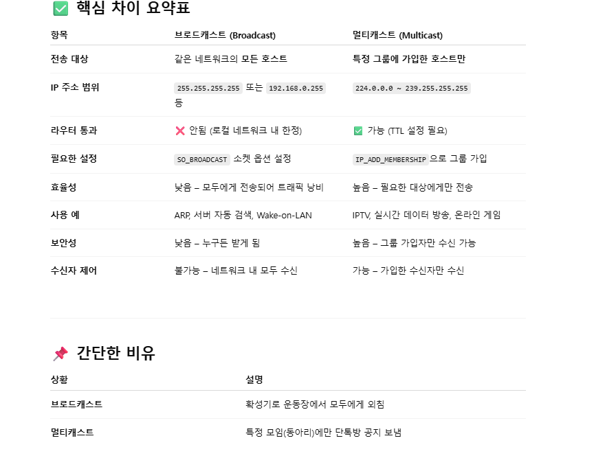

- 함수
```c
//매개변수 설명
//sockfd - 설정할 소켓의 파일 디스크립터 (socket descriptor)
// level - 옵션이 적용될 프로토콜 레벨 , 예: SOL_SOCKET (소켓 레벨 옵션), IPPROTO_TCP (TCP 레벨 옵션) 등
//optname - 설정할 옵션 이름 , 예: SO_REUSEADDR, SO_KEEPALIVE, TCP_NODELAY 등
//optval - 옵션 값을 가리키는 포인터, 옵션에 따라 다름 (예: int, struct timeval, char* 등)
//optlen - optval이 가리키는 값의 크기 (바이트 단위) , 예: sizeof(int), sizeof(struct timeval) 등
int setsockopt(int sockfd, int level, int optname,
               const void *optval, socklen_t optlen);


//매개변수 설명
//sockfd -데이터를 보낼 소켓의 파일 디스크립터.
//buf - 보낼 데이터가 저장된 버퍼의 포인터.
//len - 보낼 데이터의 길이 (바이트 단위).
//flags - 전송 동작을 조절하는 플래그. 보통 0을 쓰지만, MSG_DONTWAIT 같은 옵션도 있음.
//dest_addr - 데이터를 받을 대상 주소를 담고 있는 구조체 포인터 (struct sockaddr *).
//addrlen - dest_addr 구조체의 크기.

ssize_t sendto(int sockfd, const void *buf, size_t len, int flags,
               const struct sockaddr *dest_addr, socklen_t addrlen);
```
- 

#### 멀티캐스트 
1. 개념
- 멀티캐스트는 네트워크 상에서 특정 그룹에 가입한 호스트들만 데이터를 받을 수 있도록 전송하는 방식입니다.
- IP 멀티캐스트는 UDP 프로토콜을 기반으로 동작
- 수신자는 특정 멀티캐스트 그룹 주소에 가입해야 함
- 송신자는 한 번만 데이터를 보내고, 네트워크가 그룹에 속한 수신자들에게 복사해서 전달
- IPv4 주소 범위  224.0.0.0 ~ 239.255.255.255
- 멀티캐스트 활용 예시 : - IPTV, 화상회의 시스템,멀티플레이어 게임, IoT 장치 제어

2. 멀티캐스트 TTL
- TTL은 패킷 생존 거리를 제한하는 값
- 멀티캐스트 전파 범위 제어에 중요
- TTL이 너무 크면 불필요하게 멀리 전파되어 네트워크 부하 초래 가능
- 반대로 TTL이 너무 작으면 목표 수신자에게 도달하지 못할 수도 있음
- TTL 값에 따라 멀티캐스트가 로컬/지역/광역/글로벌까지 전파될 수 있음


3. 멀티캐스트 서버, 클라이언트
- 클라이언트(Client) - 멀티캐스트 IP 주소와 포트 번호, 그리고 보낼 메시지를 인자로 받아, 해당 멀티캐스트 그룹으로 메시지를 전송
```c
#include <stdio.h>
#include <stdlib.h>
#include <string.h>
#include <unistd.h>
#include <arpa/inet.h>
#include <sys/socket.h>


#define TTL 64

void error_handling(char* message);

int main(int argc, char* argv[])
{
        int send_sock;
        struct sockaddr_in mul_addr;
        int time_live =TTL;

        if(argc !=4)
        {
                printf("Usage:%s <GroupIP> <Port> <Message> \n", argv[0]);
                exit(1);
        }
        send_sock = socket(PF_INET, SOCK_DGRAM,0);
        if(send_sock == -1) error_handling("socket() failed");

        memset(&mul_addr, 0, sizeof(mul_addr));
        mul_addr.sin_family = AF_INET;
        mul_addr.sin_addr.s_addr = inet_addr(argv[1]);
        mul_addr.sin_port = htons(atoi(argv[2]));

        if (setsockopt(send_sock, IPPROTO_IP, IP_MULTICAST_TTL, (void*)&time_live, sizeof(time_live))==-1) error_handling("setsocket() TTL error");
        if (sendto(send_sock, argv[3], strlen(argv[3]), 0, (struct sockaddr*)&mul_addr, sizeof(mul_addr))== -1) error_handling("sendto() error");
        printf("Multicast message sent to %s:%s \n", argv[1], argv[2]);
        close(send_sock);
        return 0;
}

void error_handling(char * message)
{

        perror(message);
        exit(1);
}

```
- 서버 - 멀티캐스트 그룹에 가입(join) 합니다. 특정 포트로 들어오는 UDP 멀티캐스트 메시지를 수신합니다. 메시지가 올 때까지 계속 기다립니다 (while(1)). 수신된 데이터를 출력합니다.

``` c

#include <stdio.h>
#include <stdlib.h>
#include <unistd.h>
#include <arpa/inet.h>
#include <string.h>
#include <sys/socket.h>


#define BUF_SIZE 1024

void error_handling(char* message);

int main(int argc, char** argv)
{

        int recv_sock;
        struct sockaddr_in recv_addr;
        struct ip_mreq join_addr;
        char buf[BUF_SIZE];

        if (argc !=3)
        {
                printf("Usage: %s <GroupIp> <Port>\n", argv[0]);
                exit(1);
        }

        recv_sock = socket(PF_INET, SOCK_DGRAM, 0);
        if (recv_sock == -1) error_handling("socket() failed");

        int reuse =1;
        if (setsockopt(recv_sock, SOL_SOCKET, SO_REUSEADDR, &reuse, sizeof(reuse))<0) error_handling("setsockopt(SO_REUSEADDR) error");

        memset(&recv_addr, 0, sizeof(recv_addr));
        recv_addr.sin_family = AF_INET;
        recv_addr.sin_addr.s_addr = htonl(INADDR_ANY);
        recv_addr.sin_port = htons(atoi(argv[2]));

        if(bind(recv_sock, (struct sockaddr*)&recv_addr, sizeof(recv_addr))==-1) error_handling("bind() error");

        join_addr.imr_multiaddr.s_addr = inet_addr(argv[1]);
        join_addr.imr_interface.s_addr= htonl(INADDR_ANY);

        if(setsockopt(recv_sock, IPPROTO_IP, IP_ADD_MEMBERSHIP, (void*)&join_addr,sizeof(join_addr ))==-1) error_handling("setsockopt() Group join error");

        printf("Joined multicast group %s on port %s. Waiting for message ...\n", argv[1], argv[2]);

        while(1)
        {
                int str_len = recvfrom (recv_sock, buf, BUF_SIZE-1, 0, NULL, 0);
                if (str_len <0) break;
                buf[str_len]=0;
                printf("Received multicast message: %s\n", buf);
        }

        close(recv_sock);
        return 0;
}

void error_handling(char* message)
{
        perror(message);
        exit(1);
}  
```
- 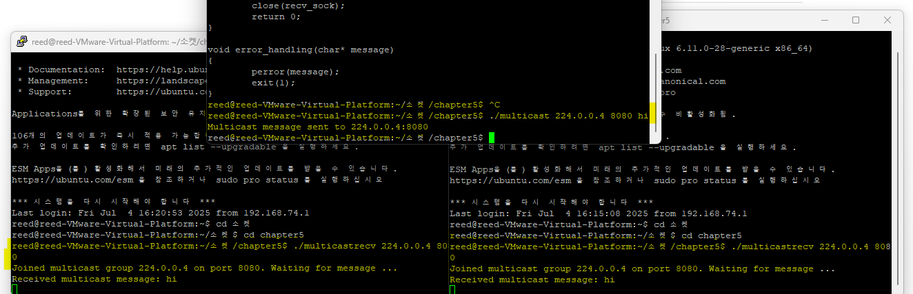


#### 브로드캐스트
1. 개념
- 브로드캐스트(Broadcast)는 네트워크 상의 모든 호스트(기기)에게 데이터를 전송하는 방식입니다.
- 같은 서브넷(로컬 네트워크)에 있는 모든 장치가 패킷을 수신합니다.
- IP 브로드캐스트 주소: 192.168.0.255, 255.255.255.255 등 (서브넷에 따라 달라짐)

2. 브로드캐스트 서버, 클라이언트
- UDP 브로드캐스트 메시지를 수신하는 서버
```c

#include <stdio.h>
#include <string.h>
#include <stdlib.h>
#include <arpa/inet.h>
#include <unistd.h>
#include <sys/socket.h>

#define BUF_SIZE 100
void error_handling(char * message);

int main(int argc, char** argv)

{
        int recv_sock;
        struct sockaddr_in recv_addr;
        struct sockaddr_in from_addr;
        socklen_t adr_sz;
        char buf[BUF_SIZE];

        if (argc !=2 )
        {
                printf("Usage: %s <port>\n", argv[0]);
                exit(1);
        }
        recv_sock = socket(PF_INET, SOCK_DGRAM, 0);
        if(recv_sock == -1) error_handling("socket() error");
        memset(&recv_addr, 0, sizeof(recv_addr));
        recv_addr.sin_family = AF_INET;
        recv_addr.sin_addr.s_addr = htonl(INADDR_ANY);
        recv_addr.sin_port = htons(atoi(argv[1]));


        if(bind(recv_sock, (struct sockaddr*)&recv_addr, sizeof(recv_addr)) == -1 ) error_handling("bind() error");
        printf("Waiting for broadcast message on port %s...\n", argv[1]);

        while(1)
        {
                adr_sz = sizeof(from_addr);
                int str_len = recvfrom(recv_sock, buf, BUF_SIZE-1, 0 , (struct sockaddr*) &from_addr, &adr_sz);
                if(str_len <0 ) break;
                buf[str_len] = 0;
                printf("Received message from %s : %s \n", inet_ntoa(from_addr.sin_addr),buf);


        }
        close(recv_sock);
        return 0;
}

void error_handling(char* message)
{
        perror(message);
        exit(1);
}


```

- 클라이언트 - 특정 멀티캐스트 그룹 주소와 포트로 메시지를 전송
```c

#include <stdio.h>
#include <stdlib.h>
#include <string.h>
#include <unistd.h>
#include <arpa/inet.h>
#include <sys/socket.h>

void error_handling(char *message);

int main(int argc, char** argv)
{
        int send_sock;
        struct sockaddr_in broad_addr;
        int so_brd = 1;

        if(argc !=3)
        {
                printf("Usage: %s <Port> <Message>\n", argv[0]);
                exit(1);
        }

        send_sock = socket(PF_INET, SOCK_DGRAM, 0);
        if (send_sock == -1) error_handling("socket() error");

        memset(&broad_addr, 0, sizeof(broad_addr));
        broad_addr.sin_family = AF_INET;
        broad_addr.sin_addr.s_addr = inet_addr("255.255.255.255");
        broad_addr.sin_port = htons(atoi(argv[1]));

        if (setsockopt(send_sock, SOL_SOCKET, SO_BROADCAST, (void*) &so_brd, sizeof(so_brd)) == -1)             error_handling("setsockopt() error");

        if (sendto(send_sock, argv[2], strlen(argv[2]), 0, (struct sockaddr*)&broad_addr, sizeof(broad_addr)) == -1) error_handling("sendto() error");
        printf("Broadcast message sent : %s\n", argv[2]);
        close(send_sock);
        return 0;
}


void error_handling(char *message)
{

        perror(message);
        exit(1);
}

```

- 

- 멀티캐스트와 브로드캐스트는 네트워크에서 동작하는 방식이 다르기 때문에, 서버 두 개를 같은 IP와 포트로 동시에 실행하는 데 있어서 동작 차이가 있는 것이 정상
- 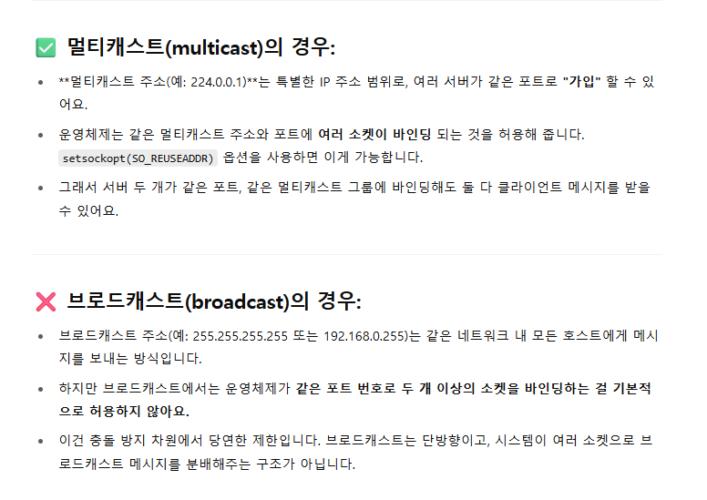
- 


## 104일차(7/7)  [./소켓/chapter6]
### thread
#### thread     
1. 정의
- 프로세스(Process) 내에서 실행되는 작업의 최소 단위
- 하나의 프로세스는 하나 이상의 스레드를 가질 수 있습니다.
- 여러 스레드는 하나의 프로세스 안에서 메모리와 자원을 공유하면서 동시에 실행됩니다.

2. 왜 스레드를 쓰는가?
- 동시성 작업을 위해: 예를 들어, 게임에서 캐릭터 움직임, 배경 음악, UI 등이 각각 스레드로 동작하면 부드러운 실행이 가능해집니다.
- 리소스 효율성: 하나의 프로세스 내에서 스레드를 여러 개 돌리면, 메모리 사용을 줄이면서도 다양한 작업을 동시에 할 수 있습니다.

3. 프로세스 vs 스레드

|항목|프로세스|스레드|
|:--:|:--:|:--:|
|독립성|독립적인 실행 단위|프로세스 내에서 실행되는 단위|
|메모리|각각 별도 메모리 사용|메모리를 공유|
|자원 관리|무거움 (생성, 종료, 전환 등)|가벼움 (빠른 생성 및 전환 가능)|
|안정성|하나가 죽어도 다른 건 영향 없음|하나가 문제 생기면 전체 영향 가능|

4. pthread 사용법
- 헤더 파일
```C
#include <pthread.h>
```

- 주요 함수들

|함수명|설명|
|:--:|:--:|
|pthread_create(pthread_t *thread,  const pthread_attr_t *attr, void *(*start_routine)(void *), void *arg)|새로운 스레드를 생성함|
|int pthread_join(pthread_t thread, void **retval);|스레드가 끝날 때까지 대기함|
|pthread_exit()|스레드를 종료시킴|
|pthread_detach()|스레드를 detach 모드로 설정|
|pthread_self()|현재 실행 중인 스레드 ID 반환|
|pthread_mutex_*()|뮤텍스 관련 함수들 (동기화용)|

```C
int pthread_create(pthread_t *thread,  const pthread_attr_t *attr, void *(*start_routine)(void *), void *arg);
// thread	생성된 스레드의 ID가 저장될 변수 포인터
//attr	스레드 속성 (NULL이면 기본 속성 사용)
//start_routine	새 스레드가 실행할 함수 포인터 (void* 반환, void* 인자)
//arg	스레드 함수에 넘겨줄 인자 (필요 없으면 NULL)

//반환값: 성공 시 0, 실패 시 오류 번호 반환
```

```C
int  pthread_join(pthread_t thread, void **retval);
// thread		종료를 기다릴 대상 스레드의 ID
//retval             대상 스레드가 pthread_exit() 또는 함수 반환 시 전달한 값을 받을 포인터. 필요 없으면 NULL
// void ** : void 포인터를 가리키는 포인터

```
5. void*는 "타입이 정해지지 않은 포인터"를 의미합니다.
- 어떤 타입의 데이터든 가리킬 수 있는 범용 포인터입니다.
- 하지만 직접 역참조하려면 형변환(type casting) 이 필요합니다.

```c
int x = 10;
void* ptr = &x;  // int를 가리키지만 void*로 저장
int y = *(int*)ptr;  // 다시 int*로 캐스팅해서 사용
```
- 

6.  왜 pthread에서 void*를 쓸까?
- 범용성(generic) *로 하나만 받는 방식으로 해결합니다. & 유연한 리턴값 처리
- **void*는 역참조 전에 반드시 형변환이 필요합니다.**
- 타입을 잘못 캐스팅하면 Segmentation Fault가 날 수 있어요.
- **메모리 할당을 동반할 경우, 스레드 종료 후 free()로 해제하는 걸 잊지 마세요.**


7. 예제
```C
#include <stdio.h>
#include <pthread.h>
#include <unistd.h>
#include <string.h>
#include <stdlib.h>

void* thread_main(void * arg);
int main()
{
        pthread_t t_id;
        int thread_arg = 5;
        void* thread_ret;

        if (pthread_create(&t_id,NULL, thread_main, (void*)& thread_arg ) != 0 )
        {
                puts("pthread_create error");
                return -1;
        }

        if (pthread_join(t_id, &thread_ret) !=0 )
        {
                puts("pthread_join error");
                return -1;
        }
        printf("Thread return message :%s\n", (char*)thread_ret);
        free(thread_ret);
        return 0;


}

void * thread_main(void* arg)
{
        int i ;
        int cnt = *((int*) arg);
        char * msg = (char*) malloc (sizeof(char) * 50 );
        strcpy (msg, "Hello I'm Thread~\n");

        for (i = 0 ; i< cnt ; i++)
        {
                sleep(1);

                puts("running thread");
        }
        return  (void*)msg;
}


```
- 

8. 동기화 문제(경쟁 상태, race condition)
- 예를 들어 다음과 같은 상황이 벌어질 수 있습니다:
- 스레드 A가 num을 읽음 → 0
- 스레드 B도 동시에 num을 읽음 → 0
- A가 num+1을 계산하고 저장 → 1
- B가 num-1을 계산하고 저장 → -1 ← A의 결과가 덮여쓰기 됨
- 이처럼 증가/감소 연산이 충돌하면, 실제로 0이 되지 않고 예상치 못한 값이 됩니다.

```c

#include <stdio.h>
#include <pthread.h>
#include <unistd.h>

long long num =0;

void* thread_inc(void* arg);
void* thread_des(void* arg);

int main()
{
        pthread_t thread_id[100];

        for (int i = 0 ; i< 100 ; i++)
        {
                if(i %2 )
                        pthread_create(&(thread_id[i]) , NULL, thread_inc, NULL);
                else
                        pthread_create(&(thread_id[i]), NULL, thread_des, NULL);
        }
        for (int j = 0  ; j < 100 ; j++)
        {
                pthread_join(thread_id[j], NULL);
        }
        printf("result : %lld\n", num);
        return 0;

}

void* thread_inc(void* arg)
{
        int i;
        for (i = 0 ; i<1000000 ;i++)
        {
                num+=1;
        }
        return NULL;
}


void* thread_des(void* arg)
{

        int i ;
        for (i = 0; i<1000000 ; i++)
        {
                num-=1;
        }
        return NULL;
}

```
- 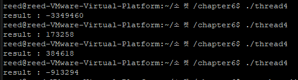

9. `동기화 해결방법(1) - pthread_mutex`
- 여러 스레드가 동시에 공유 자원에 접근하는 것을 제어해서 데이터 무결성(data integrity) 을 보장해 줍니다.
- **pthread_mutex_lock() 후 pthread_mutex_unlock()을 항상 호출해야 합니다. 안 하면 데드락(deadlock) 발생 가능**

- 주요함수

|함수|설명|
|:--:|:--:|
|pthread_mutex_init()|뮤텍스 초기화|
|pthread_mutex_lock()|뮤텍스 잠금 (다른 스레드가 잠근 상태면 대기)|
|pthread_mutex_trylock()|잠금 시도 (바로 실패할 수도 있음)|
|pthread_mutex_unlock()|뮤텍스 해제|
|pthread_mutex_destroy()|뮤텍스 제거 (더 이상 사용하지 않을 때)|

```C
#include <stdio.h>
#include <pthread.h>
#include <unistd.h>

long long num =0;
pthread_mutex_t mutex;
void* thread_inc (void* arg);
void* thread_dec (void* arg);

int main()
{
        pthread_t  range[100];

        pthread_mutex_init(&mutex, NULL);

        for (int i = 0 ; i<100 ; i++)
        {
                if (i%2) pthread_create(&(range[i]) , NULL, thread_inc , NULL);
                else pthread_create(&(range[i]), NULL, thread_dec, NULL);
        }

        for (int i = 0 ; i<100 ; i++)
                pthread_join(range[i], NULL);

        printf("result : %lld \n", num);
        pthread_mutex_destroy(&mutex);
        return 0;
}

void* thread_inc (void* arg)
{
        pthread_mutex_lock(&mutex);
        for (int j = 0 ; j<1000000 ; j++)
                num +=1;
        pthread_mutex_unlock(&mutex);
        return NULL;
}

void* thread_dec(void* arg)
{
        pthread_mutex_lock(&mutex);
        for (int j=0 ; j<1000000; j++)
                num -=1;
        pthread_mutex_unlock(&mutex);
        return NULL;

}

```
- 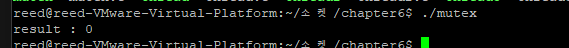

10. `동기화 해결방법(2) - semaphore`
- 운영체제와 병렬 프로그래밍에서 공유 자원의 접근을 제어하기 위해 사용되는 동기화 기법
- 뮤텍스보다 범용적 (뮤텍스는 오직 1개만 통과 가능, 세마포어는 N개 자원 관리 가능)

- 주요함수
|함수|설명|
|:--:|:--:|
|sem_init()|세마포어 초기화|
|sem_wait()|세마포어 값 감소, 0이면 대기|
|sem_post()|세마포어 값 증가, 대기 중 스레드 깨움|
|sem_destroy()|세마포어 제거|

```C
//매개변수	타입	설명
//sem	sem_t*	세마포어 변수의 주소입니다.
//pshared	int	0이면 스레드 간 공유, 0이 아니면 프로세스 간 공유입니다.
//value	unsigned int	세마포어의 초기값 (예: 1이면 이진 세마포어)
sem_init(sem_t *sem, int pshared, unsigned int value)


sem_wait(sem_t *sem)


sem_post(sem_t *sem)

sem_destroy(sem_t *sem)
```


- 예제
```C

#include <stdio.h>
#include <unistd.h>
#include <pthread.h>
#include <semaphore.h>


void * input_data(void * arg);
void * sum_calc (void * arg);
static sem_t sem_one;
static sem_t sem_two;
static int num;

int main(int argc, char* argv[])
{
        pthread_t id_t1, id_t2;
        sem_init(&sem_one, 0, 0);   // 스레드 간 공유, 초기값 0
        sem_init(&sem_two, 0, 1);   // 스레드 간 공유, 초기값 1 ->키를 가짐

        pthread_create(&id_t1, NULL, input_data, NULL);
        pthread_create(&id_t2, NULL, sum_calc, NULL);

        pthread_join(id_t1, NULL);
        pthread_join(id_t2, NULL);

        sem_destroy(&sem_one);
        sem_destroy(&sem_two);
        return 0;
}


void *input_data (void * arg)
{
        int i;
        for(i=0; i<5;i++)
        {
                fputs("Input num :", stdout);
                sem_wait(&sem_two);             //sem_two의 키를 sem_one으로 
                scanf("%d", &num);              
                sem_post(&sem_one);             //sem_one은 키가 있기에 입력을 받아 저장할 수 있다.
        }       
        return NULL;
}

void* sum_calc(void* arg)
{
        int i,  sum =0;
        for (i=0; i<5 ; i++)
        {
                sem_wait(&sem_one);      //sem_one의 키를 sem_two로 
                sum+= num;
                sem_post(&sem_two);       //sem_two은 키가 있기에 sum계산결과를 저장할 수 있다.
        }
        printf("result : %d\n", sum);
        return NULL;

}

```
- 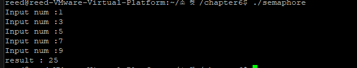