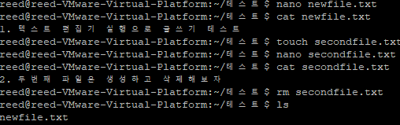
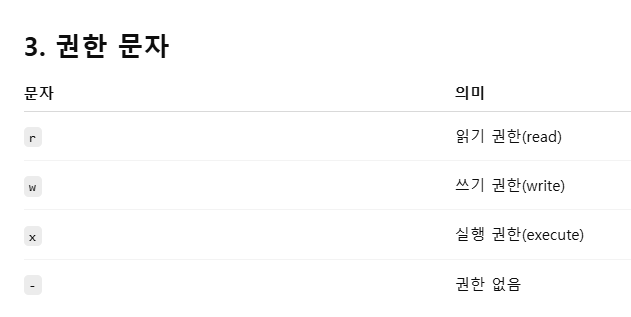

# iot_socket_2025

## 99일차(6/30)
#### vmware, ubuntu, PuTTy 설치
- ubuntu 디스크이미지 파일 다운로드
    1. https://ubuntu.com/ 
    2. Download Ubuntu - Download Ubuntu Desktop -Ubuntu 24.04.2 LTS download
        - 

- PuTTy 다운로드
    1. https://www.putty.org/ 
    2. Download PuTTY - 64-bit x86 : putty-64bit-0.83-installer.msi

- vmware 가상머신 설치
    1. https://support.broadcom.com/ - 회원가입 및 로그인
    2. VMware Cloud Foundation-  My Downloads 이동 
        - 
    3. Free Software Downloads available HERE 클릭
    4. VMware Workstation Pro - VMware Workstation Pro 17.0 for Windows - 17.6.3
    5. 이용약관 동의 - 다운로드 버튼 클릭 - 주소정보 입력
    6. VMware-workstation-full-17.6.3-24583834 응용프로그램파일을 관리자권한으로 실행 - 다운로드
    7. VMware Workstation 아이콘 실행 - create a new virtual machine - **installer disc image file을 다운로드한 ubuntu로 하기**
    8. next, finish 계속 해서 설치 마무리
        - 
    9. 우분투 기본 설정하기 
        - 언어, 계정(reed, 1234), 최소 설정 등  [참고사이트](https://movefun-tech.tistory.com/23)
        - 설치 후 다시 시작
        - 로그인- 왼쪽하단버튼- cmd 검색해서 실행
        - ifconfig 설치 [참고사이트](https://yigongyikong.tistory.com/866)
            ```
            ~$ sudo apt install net-tools
            ~$ ifconfig
            
            ```
            - 
        - openssh-server 설치
            ```
            ~$ sudo apt install openssh-server
            ~$ netstat -lnpt | grep :22
            ```
    10. Putty configuration
        - 다운로드한 putty 실행파일 실행 , configuration 설정
            - 
            - 
        

#### 준비학습

|호출순서|함수|
|:--:|:--:|
|소켓생성|socket()|
|소켓주소할당|bind()|
|연결요청대기|listen()|
|연결허용|accept()|
|데이터송/수신|read/write()|
|종료|close()|


#### 리눅스 문법 with Putty 
1. gcc 컴파일러 
    - gcc 컴파일러 설치
        ```
        sudo apt install gcc
        ```
    - C 파일 작성
        ```
        touch main.c
        nano main.c
        cat main.c
        ```
    - 실행명령
        ```
        gcc main.c -o main.out
        ./main.out
        ```
    - 

2. 자주 사용하는 기본 명령어
    - 
    - 
    - 
    - 
    - 
    - 

    - 파일/디렉토리 명령어 연습
        - 
        - 
        - 
        - 
        - 

3. 리눅스에서 파일을 열거나 생성
    - 기본형태
        ```C
        int open(const char *pathname, int flags[, mode_t mode]);
        ```
        - pathname: 열고자 하는 파일 경로
        - flags: 파일을 어떻게 열지 설정하는 옵션 (읽기, 쓰기, 생성 등)
        - mode: 새 파일을 만들 때 퍼미션 설정 (예: 0644), O_CREAT가 있을 때만 사용됨

    - 플래그
        |플래그|의미|
        |:--:|:--:|
        |O_RDONLY|읽기 전용으로 연다|
        |O_WRONLY|쓰기 전용으로 연다|
        |O_RDWR|읽기 + 쓰기 모두 가능하게 연다|
        |O_CREAT|파일이 없으면 새로 만든다|
        |O_APPEND|파일 끝에 내용을 추가해서 쓴다|
        |O_TRUNC|파일 열 때 기존 내용을 지우고 빈 상태로 연다|
        - 플래그들은 #define된 상수입니다. 예를 들어, O_RDONLY는 내부적으로 그냥 0이에요.
        - 플래그는 비트 연산(|)으로 조합할 수 있어요.
    - 파일 디스크립터
        |이름|의미|번호|
        |:--:|:--:|:--:|    
        |stdin|표준 입력 (키보드 등)|0|
        |stdout|표준 출력 (화면 등)|1|
        |stderr|표준 에러 출력|2|
        - fileno() 함수는 FILE* 스트림 (예: stdin, stdout, stderr)이 내부적으로 사용하는 파일 디스크립터 번호(int)를 반환합니다.
        ```c
        printf("stdin FD: %d\n", fileno(stdin));   // 출력: 0
        ```
        - open()은 성공하면 파일 디스크립터(file descriptor)를 반환합니다. 이건 파일을 나타내는 양수(보통 3 이상) 숫자입니다.
        - 0 이상 :	성공 
        - -1	: 실패 
    - 권한 확인
        ```cs
            ls -l
        ```
        - 
        - ---sr-s--- 에서 소유자와 기타 사용자 모두 읽기, 쓰기, 실행 권한이 없음 →즉, 파일 소유자도 읽거나 쓸 수 없는 상태입니다.
        - 이 때문에 프로그램에서 permission denied 오류가 나는 겁니다.
4. 파일 권한(퍼미션) 형식

    |위치|의미|
    |:--:|:--:|
    |1번째 문자|파일 종류|
    |2~4번째 문자|소유자(user) 권한|
    |5~7번째 문자|그룹(group) 권한|
    |8~10번째 문자|기타 사용자(other) 권한|
    - 
    -    
    - 권한 확인
        ```c
        //  -: 일반 파일
        // rwx: 소유자는 읽기, 쓰기, 실행 가능
        // r-x: 그룹은 읽기, 실행 가능 (쓰기 불가)
        // r--: 기타 사용자는 읽기만 가능
        -rwxr-xr--
        ```
    - 권한 변경
        - 
        - 
5. 성공, 실패 메시지 출력
    |상황|함수|출력대상|
    |:--:|:--:|:--:|    
    |성공 메시지|printf(), puts() 등|stdout (표준 출력, 화면)|
    |에러 메시지|perror(), fprintf(stderr, ...)|stderr (표준 에러 출력)|

6. 리틀 엔디안 vs 빅 엔디안 (Little Endian vs Big Endian)
    |개념|빅엔디안 (Big Endian)|리틀엔디안 (Little Endian)|
    |:--:|:--:|:--:|
    |의미|큰 바이트가 앞|작은 바이트가 앞|
    |저장 순서 (메모리 or 전송)|상위 바이트 → 하위 바이트|하위 바이트 → 상위 바이트|
    |예: 0x12345678|12 34 56 78|78 56 34 12|
    |사용처|네트워크 전송, 일부 CPU|x86/x86-64 (인텔/AMD) 등|

    - 네트워크에서는 시스템마다 엔디안 방식이 다르기 때문에, 모든 데이터는 "빅엔디안"으로 전송하자는 규칙이 생겼습니다.
    - 이를 "네트워크 바이트 오더(Network Byte Order)" = Big Endian 이라고 부릅니다.
    - 변환
        |함수|의미|목적|
        |:--:|:--:|:--:|
        |htonl(x)|Host TO Network Long|리틀엔디안 → 빅엔디안 변환|
        |ntohl(x)|Network TO Host Long|빅엔디안 → 리틀엔디안 변환|
        - 대부분 PC/서버는 리틀엔디안 (작은 바이트가 먼저)
        - 하지만 네트워크에서는 빅엔디안이 표준
        - 그래서 데이터를 보내거나 받을 때는 변환이 필요함

    1. 리틀 엔디안
    ```c
    #include <stdio.h>

    void main()
    {
        int n =  0x1234567;         // 16진수: 0x01234567
        char *pn = &n;              // int형 변수 n의 주소를 char 포인터로 저장

        printf("1st : %p , %#x\n" , &(*pn),  *pn);
        printf("2nd : %p , %#x\n" , &(*pn),  *(pn+1));
        return 0;
    }
    ```
    - 
    - 
 
    2. 리틀 엔디안 -> 빅 엔디안 변환
        ```c
        #include <stdio.h>
        #include <arpa/inet.h>  // htonl, ntohl 함수가 선언된 헤더

       
        void  main()
        {

                unsigned short port = 0x1234;
                unsigned int ip = 0x12345678;

                unsigned short network_port;
                unsigned int network_ip;

                network_port = htons(port);
                network_ip = htonl(ip);

                printf("ip:%#x", ip);
                printf(" port : %#x\n", port);
                printf("conversion ip: %#x", network_ip);
                printf("conversion port : %#x\n", network_port);

        }


        ```
        - 
        

7. 프로토콜 체계, 소켓 타입(전송방식)
    |인터넷프로토콜 체계|
    |:--:|
    |PF_INET<br/>IPv4 인터넷프로토콜 체계|
    |PF_INET6<br/>IPv6 인터넷프로토콜 체계|

    |소켓 타입|표현|
    |:--:|:--:|
    |TCP(연결지향형 소켓)|SOCK_STREAM|
    |UDP(비연결지향형 소켓)|SOCK_DGRAM|

    ```C
    #include <sys/socket.h>
    #include <netinet/in.h>

    //PF_INET은 IPv4 프로토콜을 사용하겠다는 뜻이고,
    //SOCK_STREAM은 TCP 소켓 타입을 의미합니다.
    int sockfd = socket(PF_INET, SOCK_STREAM, 0);

    ```